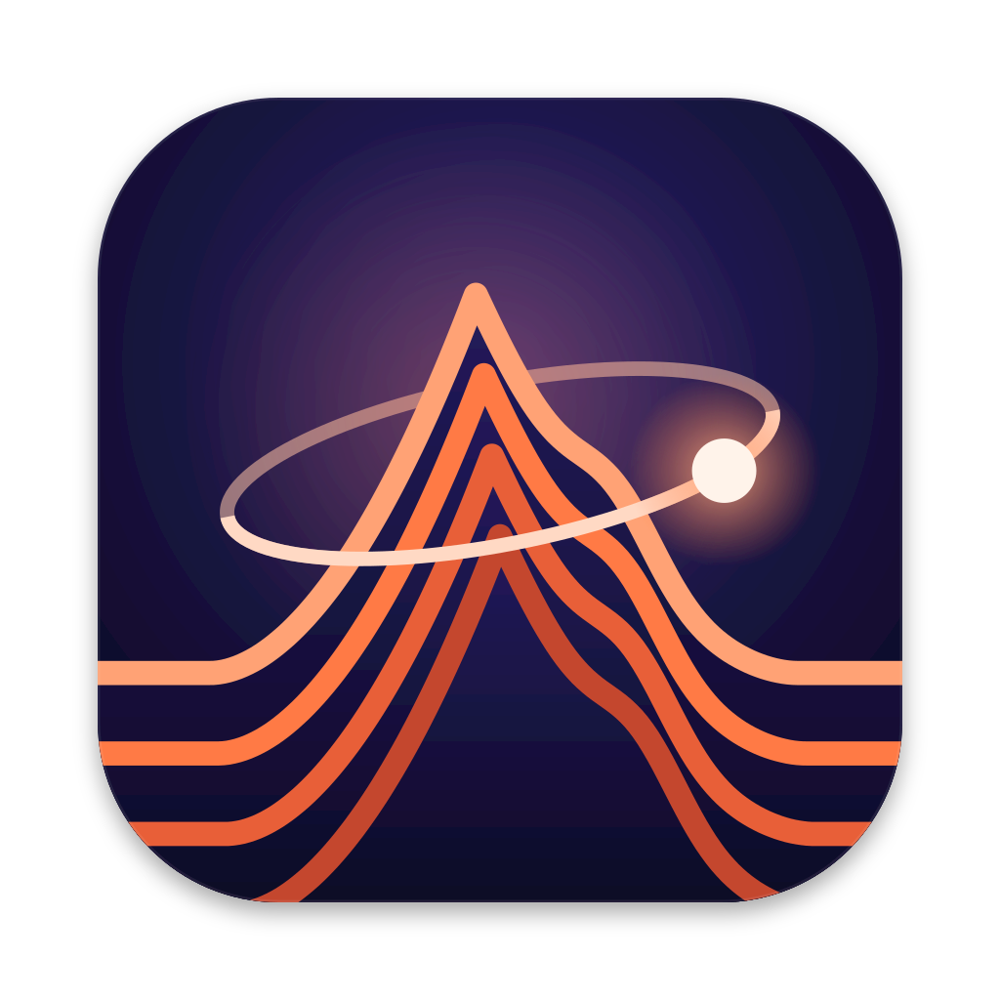

# Orograph



Orograph is a synthesizer you play by exploring a landscape. You put a glowing dot
somewhere on a 3D map, the dot's orbit sweeps across the hills and valleys, and the
shape of the land under that orbit becomes the sound. Move the dot and the tone moves
with it.

It runs as a desktop app on Mac, Windows and Linux, or in a web browser (even offline,
from a single file). It plays from your computer keyboard, the on-screen keys, its own
step sequencer, or a MIDI controller such as an Akai MPC.

## How it makes sound

Orograph uses a technique called **wave terrain synthesis**.

* **The terrain** is a height map: every point on the map has a height between a deep
  valley and a high peak. Orograph has a collection of landscapes (rolling hills,
  ridges, craters, terraces, spirals and more), and you can blend two of them.
* **The path** is a closed loop, such as a circle, a star or a flower shape, drawn
  around the dot.
* **Playing a note** sends a point around that loop over and over, once per cycle of
  the sound. At the note A above middle C that is 440 laps every second. The height
  of the ground under the moving point, read tens of thousands of times per second,
  *is* the audio waveform.

So **pitch** is how fast the point goes around, and **timbre** (the character of the
sound) is the shape of the land it crosses. Gentle hills give soft, round tones; sharp
ridges and cliffs add bright, buzzy harmonics. A bigger loop crosses more of the
landscape and usually sounds brighter. Because the dot can sit anywhere and the loop
can grow, squash, rotate and spin, small moves give smooth, continuous changes in tone,
something like moving through a wavetable but in two dimensions instead of one.

The idea comes from computer music research of the late 1970s and early 1980s (Rich
Gold; Yasuhiro Mitsuhashi; Alberto Borgonovo and Goffredo Haus). Orograph adds the
3D view, a dot that can roll around the land like a marble or drift on its own, and
modern sound shaping: a filter, envelopes, an LFO for each of the main sound knobs,
four parts that play together, a sequencer and arpeggiator, delay and reverb.

## Download

Get the newest version from the
**[Releases page](https://github.com/ChaseHendrick/synth/releases/latest)**,
or use these direct links:

| Your computer | Download |
|---|---|
| Mac with Apple silicon (M1 or newer) | [Orograph-mac-arm64.dmg](https://github.com/ChaseHendrick/synth/releases/latest/download/Orograph-mac-arm64.dmg) |
| Mac with an Intel processor | [Orograph-mac-x64.dmg](https://github.com/ChaseHendrick/synth/releases/latest/download/Orograph-mac-x64.dmg) |
| Windows 10 or 11, installer | [Orograph-windows-setup.exe](https://github.com/ChaseHendrick/synth/releases/latest/download/Orograph-windows-setup.exe) |
| Windows, no installation needed | [Orograph-windows-portable.exe](https://github.com/ChaseHendrick/synth/releases/latest/download/Orograph-windows-portable.exe) |
| Linux (64-bit PC) | [Orograph-linux-x86_64.AppImage](https://github.com/ChaseHendrick/synth/releases/latest/download/Orograph-linux-x86_64.AppImage) |
| Any computer, in Chrome or Edge | [Orograph.html](https://github.com/ChaseHendrick/synth/releases/latest/download/Orograph.html) (see [Play in the browser](#play-in-the-browser)) |

Not sure which Mac you have? Open the Apple menu and choose **About This Mac**. If it
says **Chip: Apple M1** (or M2, M3 and so on), take the Apple silicon version. If it says
**Processor: Intel**, take the Intel one.

Orograph is free and is not signed with a paid Apple or Microsoft developer
certificate, so your computer will ask you to confirm the first time you open it. This
is normal for small independent apps. Here is what to do.

### Mac: the first launch

1. Open the `.dmg` file and drag **Orograph** onto the **Applications** folder.
2. Open Orograph from Applications. macOS will say it cannot verify the app. Click
   **Done** (not "Move to Trash").
3. Open **System Settings**, go to **Privacy & Security**, and scroll down to the
   Security section. You will see a note that Orograph was blocked. Click
   **Open Anyway**, enter your password, then click **Open Anyway** once more.

From then on Orograph opens normally. You may need to repeat step 3 after installing
a new version.

On macOS 14 Sonoma or older there is a shortcut: in Applications, hold **Control** and
click Orograph, choose **Open**, then click **Open** again.

If macOS ever says **"Orograph is damaged and can't be opened"**, the app is fine; macOS
is being strict about unsigned downloads. Open the **Terminal** app and paste this line,
then press Return:

```sh
xattr -dr com.apple.quarantine /Applications/Orograph.app
```

That removes the "downloaded from the internet" flag from Orograph only.

### Windows: the first launch

When you run the installer (or the portable version), Windows may show a blue box
titled **"Windows protected your PC"**. Click **More info**, then **Run anyway**.

The installer lets you choose where Orograph goes and adds it to the Start menu and
the desktop. The portable version needs no installation: keep the `.exe` anywhere,
for example on a USB stick, and double-click it to play. It starts a little slower
because it unpacks itself each time.

### Linux: the first launch

The AppImage is a single file that runs without installing. Make it executable once,
then start it:

```sh
chmod +x Orograph-linux-x86_64.AppImage
./Orograph-linux-x86_64.AppImage
```

You can also right-click the file, open **Properties**, and turn on **Allow executing
file as program**. If nothing happens, your system may need FUSE 2 (on Ubuntu 22.04:
`sudo apt install libfuse2`; on Ubuntu 24.04 and newer: `sudo apt install libfuse2t64`).
If it still closes right away on Ubuntu 24.04 or newer, start it from a terminal with
`./Orograph-linux-x86_64.AppImage --no-sandbox`. A plain `.tar.gz` folder version is on
the Releases page too.

## Play in the browser

No installation at all:

* **Online:** <https://www.hendrickresearch.com/music/orograph/>
* **Offline:** download **Orograph.html** from the
  [Releases page](https://github.com/ChaseHendrick/synth/releases/latest) and
  double-click it. The whole synthesizer is inside that one file, so it works on a
  plane, in a practice room, or anywhere without internet.

Use a recent **Chrome** or **Edge** for the best results, especially for MIDI. Other
browsers can play sound, but some cannot talk to MIDI devices. The first time you
connect a MIDI device the browser asks for permission; click **Allow**.

## Quick start

1. **Open Orograph.** If you see a Start button, click it to switch the sound on
   (browsers need one click before any web page may make noise).
2. **Place the dot.** Click anywhere on the 3D map, or drag the dot. Its orbit is the
   bright loop around it. Drag empty space to turn the view, and scroll to zoom.
3. **Twist knobs.** Try **Size** (how big the orbit is: bigger is brighter), **Morph**
   (blend from one landscape to the other), **Warp** (makes the land itself ripple) and
   **Fold** (adds sparkle).
4. **Play keys.** Use the on-screen keyboard, your computer keyboard, or a MIDI
   controller.
5. **Press Play.** The step sequencer plays a pattern so you can keep both hands on the
   knobs. Change the landscape, the path shape and the dot's behaviour (pinned, rolling
   like a marble, or drifting) and listen to how the sound follows.

Your last session is saved automatically, so Orograph opens where you left off.

## Connect an Akai MPC (or any MIDI controller)

Orograph works with class-compliant USB MIDI devices, including Akai MPCs in
Standalone mode.

1. Connect the MPC's **USB-C** port to your computer with a USB cable that carries
   data (some charging-only cables do not).
2. In Orograph, open **Settings**, go to **MIDI & MPC**, and turn on the MPC input
   (its name contains "MPC").
3. On the MPC, set a MIDI track's output to the USB MIDI port and play the pads.

The in-app guide (Settings, MIDI & MPC) walks through the MPC menus step by step,
including Q-Link knobs (with MIDI Learn), sending notes from Orograph back to the MPC,
and keeping tempo in sync. If no MIDI device shows up, close other music software that
might be using the port, try another cable, and on Windows install the MPC driver from
Akai's software center.

MIDI works in the desktop app and in Chrome or Edge.

## Keyboard shortcuts

Press **?** in the app to see every shortcut.

## Build it yourself

You only need this if you want to change Orograph. Install
[Node.js](https://nodejs.org) version 22 or newer, download this project, then run
these commands in a terminal inside the project folder:

| Command | What it does |
|---|---|
| `npm ci` | Installs the exact tools and libraries the project uses (run once). |
| `npm run dev` | Starts Orograph at http://127.0.0.1:5173 and reloads as you edit. |
| `npm test` | Runs the automated tests. |
| `npm run build` | Builds the web app into `dist/`. |
| `npm run build:single` | Builds the one-file offline version into `dist-single/index.html`. |
| `npm run electron` | Builds, then opens the desktop app from the source code. |
| `npm run dist` | Builds the desktop app for your computer into `release/`. |

Every change pushed to the `main` branch is built automatically for Mac, Windows and
Linux by GitHub Actions and published on the
[Releases page](https://github.com/ChaseHendrick/synth/releases/latest).

## Project layout

| Folder | Contents |
|---|---|
| `src/core/` | Parameters, the shared state store, loading of saved sessions |
| `src/dsp/` | The sound engine: terrains, paths and the synthesizer voice |
| `src/audio/` | Audio setup, effects, recording, importing images and WAV files |
| `src/visual/` | The 3D landscape, the orbit and the dot (three.js, Rapier physics) |
| `src/ui/`, `src/styles/` | Knobs, panels, keyboard, sequencer grid, themes |
| `src/music/`, `src/midi/`, `src/presets/` | Sequencer, arpeggiator, MIDI, factory sounds |
| `electron/` | The desktop app shell |
| `public/`, `build/` | Icons and the web app manifest |
| `tests/` | Automated tests |
| `docs/` | Architecture notes and the MPC research behind the in-app guide |
| `dev/` | Developer test pages and tools (icon and notice generators) |

## Independent work

Orograph is an independent, clean-room implementation of wave terrain synthesis,
written from first principles and published mathematics. No code, graphics, sounds
or presets from any other product were used. It was inspired by the idea behind the
Conductive Labs Terrain Synth. Terrain Synth is a trademark of Conductive Labs.
Orograph is not affiliated with, endorsed by, or connected to Conductive Labs.

## License

Orograph is free and open source under the [MIT License](LICENSE). The libraries it
includes, and their licenses, are listed in
[THIRD_PARTY_NOTICES.md](THIRD_PARTY_NOTICES.md).

## Credits

Made by Chase ([Hendrick Research](https://www.hendrickresearch.com)), written with
the help of Claude Code. 3D graphics by [three.js](https://threejs.org), marble physics
by [Rapier](https://rapier.rs), desktop app by [Electron](https://www.electronjs.org).
