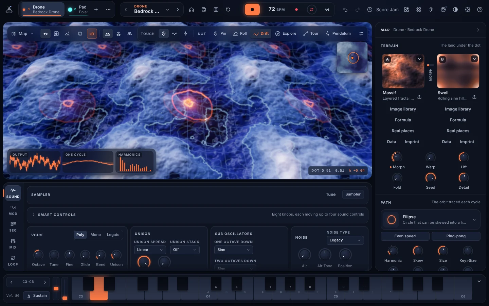
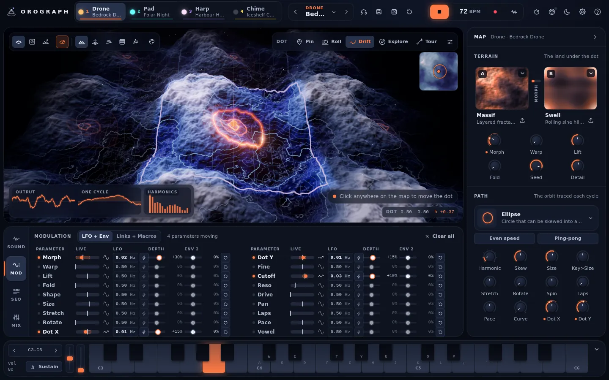
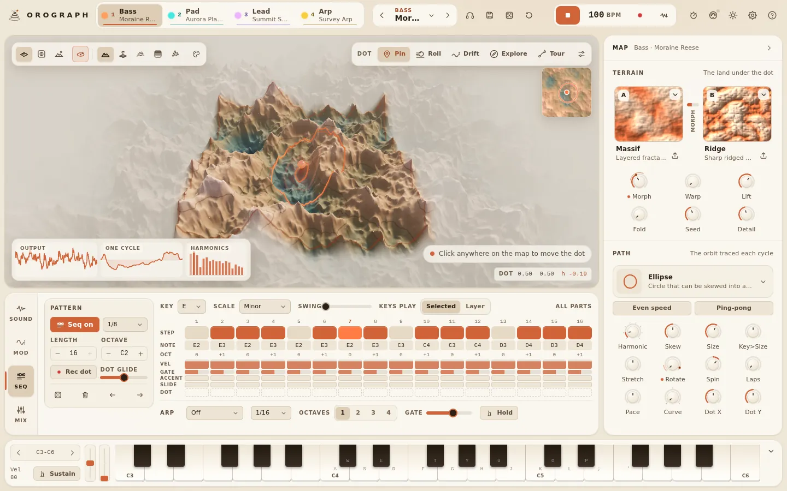

# Oro user guide

Oro is a synthesizer you play by moving a glowing dot over a landscape. This guide
explains what every part of it does and why, for a musician who likes to know what is
going on under the hood. It describes version 2.6.0, including the guitar pedal features
([section 15](#15-guitar-pedals)), and the looper and Resample
([section 12](#12-recording-and-bouncing)). Voice input, new in 1.4, is in
[section 13](#voice-14).



**Contents**

1. [What wave terrain synthesis is](#1-what-wave-terrain-synthesis-is)
2. [Your first five minutes](#2-your-first-five-minutes)
3. [A tour of the screen](#3-a-tour-of-the-screen)
4. [The map and the dot](#4-the-map-and-the-dot)
5. [Terrains](#5-terrains)
6. [Paths](#6-paths)
7. [Sound: voice, filter, envelopes](#7-sound-voice-filter-envelopes)
8. [Modulation](#8-modulation)
9. [Music: parts, sequencer, arpeggiator](#9-music-parts-sequencer-arpeggiator)
10. [Patches and scenes](#10-patches-and-scenes)
11. [Mixing and effects](#11-mixing-and-effects)
12. [Recording and bouncing](#12-recording-and-bouncing)
13. [Settings](#13-settings)
14. [MIDI and the Akai MPC XL](#14-midi-and-the-akai-mpc-xl)
15. [Guitar pedals](#15-guitar-pedals)
16. [Keyboard shortcuts](#16-keyboard-shortcuts)
17. [Troubleshooting](#17-troubleshooting)
18. [Credits and clean-room statement](#18-credits-and-clean-room-statement)
19. [Expanded 2.0 controls](#19-using-the-expanded-20-controls)

---

## 1. What wave terrain synthesis is

Picture a landscape seen from above. Every point on it has a height. Now trace a closed
loop over it, again and again, and write down the height under your pencil as you go.
That list of heights is a waveform. Play it back fast enough and you hear a tone.

That is the whole idea, and it fits in one line:

```
sample(t) = height( path(t) )
```

In a little more detail, for a note of frequency *f*:

```
phase      φ(t)  = frac(f · t)                         one trip round the loop per cycle
point      (u,v) = dot + rotate(θ) · scale(size, stretch) · path(φ)
sample     s(t)  = shape( height(u, v) )               shape = Lift and Fold
```

* **Pitch** is how fast the point goes round the loop. At A4 (440 Hz) it laps the loop
  440 times a second.
* **Timbre** is the shape of the land under the loop. A loop over gentle hills gives a
  round, nearly sinusoidal tone. A loop that crosses sharp ridges or cliffs picks up
  sudden changes in height, and sudden changes mean high harmonics.
* **Movement** comes from changing either side: move the loop (the dot, its size, its
  rotation) or change the land (morph between two terrains, warp it). Because both are
  continuous, small moves give small, smooth changes in tone. It behaves a lot like a
  wavetable, except that the "table" is two-dimensional and you can wander through it in
  any direction.

A few facts about Oro's version of the technique:

* **The map wraps.** The landscape is a torus: walk off the right edge and you come back
  on the left, walk off the top and you come back at the bottom. Every terrain is built
  so that its height and slope match across the seams, so the dot and the loop can go
  anywhere without clicks. Map coordinates run from 0 to 1 in each direction.
* **Heights are normalised.** Every built-in terrain is scaled so its highest peak or
  deepest valley reaches exactly 1 and its average height is 0, so switching terrains
  does not jump in level.
* **Two terrains at once.** Each part holds Terrain A and Terrain B and blends them with
  Morph: `h = (1 − morph) · A + morph · B`.
* **Aliasing is handled.** A loop that crosses a lot of detail at a high pitch can produce
  harmonics above what the sample rate can carry, which fold back as harsh tones. Oro
  runs its oscillator at twice the output sample rate by default, reads each terrain from
  a pre-smoothed copy (a "mip level") chosen from how fast the point is travelling, and
  filters the result back down. The [quality modes](#audio-quality) let you trade
  processing for cleanliness, or turn the smoothing off on purpose.

The technique comes from computer music research around 1978 to 1986 (Rich Gold, Yasuhiro
Mitsuhashi, Alberto Borgonovo and Goffredo Haus). The [research brief](RESEARCH.md) has
the history, the maths of every terrain and path family, and the reasoning behind
Oro's design.

---

## 2. Your first five minutes

1. **Open Oro.** In a browser you will see a **Start** button: browsers only let a
   page make sound after you click or press a key, so click it (or press almost any key).
   The first time, Oro loads a factory scene called **First Light** with four parts
   ready to play.
2. **Press Space** (or the Play button in the top bar). The parts play their sequencer
   patterns together. Press Space again to stop.
3. **Click anywhere on the 3D map.** The dot glides there and the sound changes with it.
   Try a few places: valleys, slopes, the top of a ridge.
4. **Twist a few knobs** in the Map panel on the right: **Size** (a bigger loop crosses
   more land and usually sounds brighter), **Morph** (blend Terrain A into Terrain B),
   **Warp** (the land itself ripples) and **Fold** (adds sparkle).
5. **Pick a part** with the keys **1** to **4** (or click a part tab at the top). The map
   always shows the selected part's land and dot. Step through its patches with the **‹**
   and **›** arrows beside the patch name in the top bar.
6. **Play notes** with your computer keyboard: the row **A W S E D F T G Y H U J K O L P ;
   '** is a piano keyboard starting at C. **Z** and **X** move it down and up an octave.
   **Shift + P** plays a short phrase that suits the current patch.
7. **Change the dot's behaviour** with the buttons at the top right of the map: try
   **Roll**, then drag the dot and let go. It becomes a marble that rolls downhill, and the
   sound follows it.

Oro saves your session in the browser (or the desktop app) as you go, so next time it
opens where you left off.

---

## 3. A tour of the screen

| Area | What is there |
|---|---|
| **Top bar** | The four part tabs (name, patch, a light that shows notes), the patch browser (with Preview, Save, Dice and Init), the transport (Play, tempo, Record, Bounce), and buttons for the Macros, MIDI, theme, Settings and Help. |
| **3D map** (centre) | The selected part's land, its loop (the path) and the dot. View, style and palette buttons at the top left, dot behaviour at the top right, a minimap in the corner, the signal views at the bottom left, the dot's position at the bottom right. |
| **Map panel** (right) | Terrain A and B, the terrain knobs, the path picker and the path knobs. Collapse it with the arrow in its header. |
| **Dock** (bottom) | Four tabs: **Sound** (voice, filter, envelopes), **Mod** (every LFO and envelope depth, plus Links and Macros), **Seq** (sequencer, arpeggiator, key and scale) and **Mix** (channel strips and master effects). |
| **Keyboard** (very bottom) | An on-screen piano with octave buttons, a sustain button, and pitch bend and mod wheel strips. Hide it with the arrow on the right. |

On a phone or a narrow window the layout switches to tabs along the bottom: **Map**,
**Sound**, **Mod**, **Seq**, **Mix** and **Keys**.

### Knobs

Every knob works the same way:

* **Drag** up or down (or left and right). Hold **Shift** for fine control.
* **Scroll** over a knob to nudge it.
* **Double-click** (or Ctrl / Cmd + click) to reset it to its default.
* With a knob focused, the **arrow keys** adjust it and **Page Up / Page Down** take big
  steps. **Enter** lets you type an exact value.
* **Right-click** (or long-press on a touch screen) for a menu: **Modulate...**, **MIDI
  Learn**, **Remove MIDI mapping**, **Type a value...** and **Reset**.

A knob that is being modulated shows a thin outer arc for its range and a small bead that
follows the live value coming back from the sound engine.

### Signal views

The card at the bottom left of the map shows three things, all for the selected part:

* **Output**: an oscilloscope of what you are hearing, triggered so the trace stands still.
* **One cycle**: one exact period of the waveform, computed by walking the current path
  over the current land with the same maths the oscillator uses (including Laps and Pace).
  It updates as you move the dot, so you can see the tone you are about to hear.
* **Harmonics**: the strength of the first 16 harmonics of that cycle, on a logarithmic
  scale that spans 48 dB. The first, lighter bar is the Sub oscillator, an octave below.

---

## 4. The map and the dot

The **dot** is the centre of the loop. Its position is two numbers, **Dot X** (west to east)
and **Dot Y** (north to south), each from 0 to 1. Each part has its own dot; the map shows
the selected part.

### Moving around

| Do this | What happens |
|---|---|
| Click or tap the land | The dot glides to that spot. |
| Drag the dot | Moves it exactly where you put it. |
| Drag the empty sky, or drag with the right or middle mouse button | Turns the camera. |
| Scroll, or pinch with two fingers | Zooms. |
| Click the map, then use the **arrow keys** | Nudges the dot (hold Shift for smaller steps). **+** and **−** zoom. |
| **Shift**-drag the dot | Changes the loop's **Size**. |
| **Alt**-drag the dot | **Rotates** the loop. |
| Scroll over the dot | Changes the loop's **Size** (elsewhere, scrolling zooms). |
| **[** and **]** while the map has focus | Shrink and grow the loop (hold Shift for smaller steps). Elsewhere these keys step through patches. |

The **view buttons** at the top left choose a camera (**Orbit**, **Top** and **Low**). The camera menu also offers **Front**, **Side**,
**Diagonal** and named saved views. The remaining controls
switch **auto-rotate** on or off (a slow circle round the map in Orbit view), choose a
**map style** (**Relief** for shaded land, **Wireframe**, **Contours**, **Heat map** to colour
by height, **Points**, or **Normals** for surface orientation) and open the **palette** of land colours.

On the map, a thin line shows the loop as the knobs set it and a bright line shows it as it
actually moves, with modulation. When notes are playing and their loops differ (for
example with Key>Size, or a link from velocity), each voice's loop is drawn too. Numbered
square badges mark [dot locks](#dot-locks-in-the-sequencer) and flash when their step plays;
numbered round pins and a dashed route show a Tour; rings open where the Explore marble
passes a peak or a valley.

**The map has no edge.** The land repeats in every direction (it is the same tile over and
over, see [what wave terrain synthesis is](#1-what-wave-terrain-synthesis-is)), so you can drag,
glide, roll or tour the dot as far as you like: there are no walls, seams or borders. When the
dot heads towards the edge of the view, the camera follows it (never while you are dragging
it). The sound only depends on where the dot is within the tile, so travelling doesn't change
it.

The **minimap** in the top right corner of the view is a flat, top-down picture of the whole
map with the loop and the dot. Click or drag on it to place the dot precisely; it is the
quickest way to jump across the map. It moves the dot within the copy of the land you are
looking at.

The readout at the bottom right shows the dot's position and, while sound is running, the
height of the land under it (**h**, from −1 to +1).

If your computer cannot run the 3D view (WebGL switched off or unavailable), Oro shows
a flat, top-down map in its place. Click or drag on it to move the dot. Everything else
works as usual, except placing Tour waypoints, which needs the 3D map.

### Dot behaviours

The buttons at the top right of the map set what the dot does on its own. The sliders
button next to them opens the settings for the current behaviour.

* **Pin** keeps the dot exactly where you put it.
* **Roll** turns the dot into a marble that rolls downhill under gravity, using a real
  physics engine. Drag it and let go mid-movement to throw it (a "flick").
  Settings: **Gravity** (up to 2 g), **Friction** (how fast it slows down), **Bounce**,
  **Flick** (how hard a throw sends it) and **Tilt X / Tilt Y**, which lean the whole world
  by up to about 17 degrees so the marble drifts in one direction.
* **Drift** lets the dot wander slowly and smoothly by itself. Setting: **Speed**.
* **Explore** lets the marble roam under a slowly turning push, and plays an in-key note
  whenever it passes a peak or the bottom of a valley. Higher ground plays higher notes,
  and high peaks and deep valleys play louder. Notes use the global key and scale and start
  from the part's sequencer octave; while the transport runs they snap to the next
  sixteenth. Settings: the marble controls above, plus **Density** (the shortest gap
  between notes, from two beats down to a sixteenth), **Range** (how many octaves the
  land's height spans, 1 to 4) and **Play notes** (switch the notes off to keep only the
  movement).
* **Tour** moves the dot through up to 8 **waypoints** in time with the tempo. Turn on
  **Edit on map**, then click the map to add a waypoint, drag one to move it, or right-click
  (or long-press) one to delete it. Each waypoint has its own travel time to the next one,
  from a quarter of a beat to 16 beats. The dot follows a smooth curve through the
  waypoints (the dashed route on the map), slows into each one and lands on it on the beat.
  The tour can **Loop**, go back and forth (**Ping-pong**) or play **Once** and stop at the
  last waypoint.
* **Pendulum** (2.1) hangs a double pendulum (two equal arms, seen from above) from the
  spot where you put the dot, and the dot rides the tip of the lower arm. At low **Energy**
  it swings gently and regularly; above −1 the lower arm can flip over, and above 1 both
  arms can, so the path turns chaotic and never repeats. Settings: **Energy** (−2.95 to 4),
  **Reach** (how long the arms are on the map) and **Speed**. Move the dot to hang the
  pendulum somewhere else; it starts again from rest there.

While the marble moves, its speed and the height under it are sent to the sound engine,
where they are available as modulation sources (**Marble Speed** and **Marble Height**, see
[Links](#links)).

### Dot locks

The sequencer can also move the dot: each step can carry a **dot lock**, a spot the dot
glides to when that step plays. See [Dot locks in the sequencer](#dot-locks-in-the-sequencer).

---

## 5. Terrains

Each part has two terrain slots, **A** and **B**. Click a slot to open a grid of every
terrain with a live preview, then pick one. The knobs below the slots shape the land:

| Knob | What it does |
|---|---|
| **Morph** | Blends from Terrain A (0) to Terrain B (1). |
| **Warp** | Bends the map's coordinates with smooth waves, so the land itself ripples. Applied identically to the sound and the picture. |
| **Lift** | Scales the height (0.25x to 4x) before Fold, like driving a signal harder into a shaper. |
| **Fold** | Wavefolds the peaks back down. Adds bright harmonics; combined with Lift it can get wild. |
| **Seed** | Picks a different variation (0 to 99) of the procedural terrains. |
| **Detail** | How much fine detail a procedural terrain gets. The exact meaning depends on the terrain. |

Seed and Detail rebuild the terrain tables, which takes a moment; Morph, Warp, Lift and Fold
are instant and can be modulated.

### The built-in terrains

These descriptions say what each one *tends* to sound like. The loop's size and position
matter just as much, so treat them as starting points.

| Terrain | The land | What it tends to sound like |
|---|---|---|
| **Swell** | A few broad, rolling sine hills. | Smooth, round, vocal tones. Brightness follows the loop's Size closely. |
| **Ripple** | Concentric waves around a centre, like a stone dropped in a pond, with a weaker second stone for interference. | Round tones whose brightness follows Size; a loop that crosses more rings picks up more harmonics. |
| **Bessel** | A cosine field bent by a second cosine. Along a circular loop this is phase modulation inside phase modulation. | FM-style bells and growls. Detail spreads the sidebands wider. |
| **Dunes** | Wind-blown parallel ridges with a long gentle side and a steep face, meandering slowly. | Crossing the ridges reads their saw-like profile; running along them is calmer. |
| **Ridge** | Sharp ridged noise mountains where detail gathers on the crests. | Bright, buzzy edges whenever the loop crosses a crest. |
| **Massif** | Layered fractal mountains (4 to 7 layers of detail). | Complex, evolving spectra. Small moves of the dot change the tone a lot. |
| **Craters** | Gentle plains scattered with impact craters and raised rims. | Mostly calm, with sharp accents where the loop crosses a rim. |
| **Terraces** | Stepped plateaus joined by short risers. | Hard edges: square-ish, gritty tones. |
| **Cells** | Rounded basins where cells meet in soft creases. | Hollow, nasal tones. |
| **Canyon** | A plateau cut by deep, steep-walled valleys. | Flat tops broken by sharp dips; loops that cross a valley get a pulse-like edge. |
| **Spectra** | A wavetable laid out as land: each row (west to east) is one band-limited single cycle, and moving north or south morphs sine, triangle, saw, square and pulse. | Classic synth waveforms. Use the **Scan** path to read one row like a wavetable, and move **Dot Y** to pick the waveform. Detail sets how many harmonics each wave has. |
| **Lattice** | A soft checkerboard whose edges sharpen with Detail. | Hollow, square-wave buzz. |
| **Vortex** | Spiral arms winding out of a centre inside a disc, with a gentle swirl outside it. | Crossing the arms gives a run of harmonics that shifts as you move round the centre; outside the disc it is gentler. |
| **Imported** | Your own image or WAV file. | Whatever you bring. See below. |

### Formula terrains (2.3)

The **Formula** button under terrain A or B builds the land from a height formula
z = f(x, y). **x** and **y** run from −1 to 1 across the tile, **r** is the distance from
the centre and **th** the angle. You can use numbers, **pi**, **e**, + − * / % and ^,
comparisons (which give 1 or 0) and the functions sin, cos, tan, asin, acos, atan, atan2,
sinh, cosh, tanh, abs, sqrt, cbrt, exp, log, floor, ceil, round, sign, fract, min, max,
pow, mod, hypot, clamp, mix, step, smoothstep and noise(x, y). Examples are one click
away (Ripples, Egg crate, Saddle, Spiral, Terraces, Interference). The heights are
stretched to the full range, and the tile is mirrored so it always joins without a seam.
Formulas are only maths: nothing else can be reached from them.

Tick **Fill A and B** to build terrain A with **t** = 0 and terrain B with **t** = 1; turning
**Morph** then moves t between them, so Morph animates your formula. A formula terrain is
saved with its patch and remembers its formula, so you can reopen and edit it.

### Importing your own terrain

Click the small import button next to a slot (or drop a file straight onto the slot) to
load your own land into it.

**Images become height maps.** Bright is high, dark is low. Before importing, Oro asks:

* **Height from**: **Brightness**, or a single colour channel (**Red**, **Green**, **Blue**),
  which is handy for maps that store height in one channel.
* **Smoothing**: softens the image before use. Photos usually need some; clean
  gradients need little.
* **Edges**: **Mirror** reflects the image so any picture tiles without a seam. **Wrap**
  keeps it as it is, for images that already tile.

Images are centre-cropped to a square and reduced to 512 by 512 points.

**16-bit height maps (DEMs).** Real elevation data, such as a digital elevation model
exported as a 16-bit greyscale PNG, is read by Oro's own PNG decoder at full 16-bit
precision instead of through the browser (which would cut it to 8 bits and add colour
management). Grey values are treated as heights, not as light. This keeps gentle slopes
smooth instead of turning them into tiny terraces, so real mountains and coastlines become
playable land.

**Audio imports.** Choose **Recording** to map a complete recording across the terrain,
or **Wavetable** for single-cycle frames. WAV decoding is sample-exact; other formats use
the browser audio decoder. In Wavetable mode, Oro splits a WAV into
single-cycle frames: it uses the frame size stored in the file if there is one (a `clm`
chunk, as many wavetable editors write), otherwise multiples of 2048 samples, then 1024,
512 or 256, and failing all of those it treats the file as one cycle. Each frame is
band-limited and resampled to 512 points, up to 512 frames. On the map each frame becomes
one row, so the **Scan** path plays one frame and **Dot Y** moves through the table, just
like Spectra.

Imported files can be up to 25 MB. Your terrain is saved with the session and with any
patch or scene you save from that part.

---

## 6. Paths

The **path** is the closed loop the point traces once per cycle. Click the path button in
the Map panel to choose a shape from a grid of drawings. Every path has two shape controls
whose names change with the path: **Order** (a whole number from 1 to 8) and **Shape** (a
continuous control from 0 to 1).

| Path | Order is | Shape is | The loop |
|---|---|---|---|
| **Ellipse** | Harmonic | Skew | A circle that can be skewed into a line. The purest tone. |
| **Lissajous** | Ratio | Phase | Two sine motions at a frequency ratio of n to n+1. |
| **Rose** | Petals | Bloom | A flower with n petals. |
| **Polygon** | Sides | Round | A straight-edged polygon (a triangle at 3) that can be rounded off. |
| **Star** | Points | Pinch | A star with n points and an adjustable inner radius. |
| **Spiral** | Turns | Core | Spirals out and back in each cycle. |
| **Scan** | Zigzag | Slant | A straight sweep across the map, like reading one row of a wavetable. |
| **Spirograph** | Loops | Pen | Looping curves like the classic drawing toy. |
| **Figure 8** | Lobes | Width | A figure eight, with extra lobes at higher orders. |
| **Epicycloid** | Cusps | Depth | A wheel rolling round a wheel: cardioids and cusps. |
| **Superformula** | Symmetry | Pinch | Rounded blobs through to pinched stars. |
| **Scribble** | Seed | Chaos | A smooth random closed loop. Change Order for a new one. |

### Warp modes (2.3)

**Warp mode** and **Warp amt** (Path card) bend how the point travels the path each cycle.
Laps already gives hard sync and Pace bends the speed, so these add four more:

* **PWM** traces the whole path in the first part of the cycle, then waits at its end
  for the rest. More amount = a shorter trace, a thinner, buzzier sound.
* **Quantize** moves the point in steps along the path (from 256 steps down to 2), a
  stepped, bit-crushed character.
* **Flip** sends the end of each cycle through the orbit's centre to the opposite side,
  a sudden jump in the land it reads, for hollow, sync-like tones.
* **Spiral** shrinks the loop through each cycle towards the centre, so every cycle
  sweeps from the outer land inward.

Warp amt is modulatable. At 0 every mode sounds exactly like Off.

### Placing and sizing the loop

| Knob | Range | What it does |
|---|---|---|
| **Size** | 0 to 0.5 (half the map's width) | The loop's radius. Bigger crosses more land and usually sounds brighter. At 0 the loop shrinks to a single point, the height under it stops changing, and the terrain oscillator falls silent (Sub and Air still play if they are up). |
| **Stretch** | −1 to +1 | Squashes the loop wide or tall: up to about 2.8 times wider and 0.35 times as tall at +1, the reverse at −1. |
| **Rotate** | 0 to 360° | Turns the loop. Modulating it wraps round smoothly. |
| **Spin** | −4 to +4 Hz | Rotates the loop continuously, all voices of the part together. Slow spins make slow, cyclic sweeps of the tone; faster spins make it shimmer. |
| **Dot X / Dot Y** | 0 to 1 | Where the dot sits. The same as moving it on the map. |

The exact transform, shared by the sound and the picture, is:

```
ax = 2^(1.5 · stretch),  ay = 2^(−1.5 · stretch)
x  = path.x · ax · size,  y = path.y · ay · size
θ  = rotate + 360° · spin phase
u  = dotX + x cos θ − y sin θ,   v = dotY + x sin θ + y cos θ     (wrapped into 0..1)
```

### How the point travels: Laps, Pace and Travel

These three change *when* the point is where along the loop, without changing the loop's
shape. They are the most "synth-like" controls in Oro.

**Laps** (1 to 8) traces the loop that many times per cycle and restarts it at the start of
every cycle. At whole numbers the waveform simply repeats (2 laps sound an octave up, 3 an
octave and a fifth). In-between values cut the last lap short and restart, which is exactly
what **hard sync** does on an analogue synth: the pitch stays on the note, and sweeping Laps
gives the classic tearing sync sound. The restart is smoothed (band-limited) so it does not
alias.

**Pace** (−1 to +1) speeds the point up and slows it down within each cycle, a form of
**phase distortion**. At 0 the point moves at the path's natural speed. **Curve** picks how
Pace bends the speed:

* **Bend**: one speed-up and one slow-down per cycle.
* **Skew**: splits the cycle into two halves at different speeds, with smoothed knees, in
  the manner of classic phase distortion synths. Positive and negative Pace move the knee
  in opposite directions.
* **Pinch**: two symmetric speed-ups per cycle.

Pace is applied before Laps: `t = frac(laps · g(φ))`, where `g` is the Pace curve.

**Even speed** (the **Travel** setting) changes how the point moves along the loop.
Normally it follows the curve's maths, so it rushes round some corners and dawdles on
others. With Even speed on, it moves at a constant speed along the loop's length.

**Ping-pong** (the **Direction** setting) runs each lap forward and then backward. The
waveform of each lap becomes a mirror image of itself, and open-ended loops such as
**Scan** never jump from end to start. It is applied after Pace and Laps.

**Key>Size** (−1 to +1) makes the loop's size follow the keyboard. Negative values shrink
the loop for higher notes (and grow it for lower ones), which keeps high notes from turning
harsh, much like brightness tracking on a filter. The rule is
`size × 2^(keySize · (note − 60) / 24)`, so at −1 the loop is half the size two octaves
above middle C.

---

## 7. Sound: voice, filter, envelopes

Everything here is in the **Sound** tab and applies to the selected part. The signal flow of
one voice is: oscillator (path over terrain, then Lift and Fold) → plus Sub and Air →
Drive → filter → amp envelope → pan. Because Sub and Air go in before the filter, the
filter and the amp envelope shape them too.

### Smart controls (2.8)

The **Smart controls** card at the top of the Sound tab holds eight knobs for the selected
track. Each smart knob can move up to four of the track's sound controls at once, envelope
times included (since 2.9), each across its own range, so one knob can open the filter,
lengthen the release and add some Fold together. Mute, solo and the pedal routing belong to
the mix and cannot be targets.

* **Choose a knob** by clicking it or tabbing to it. The editor beside the knobs shows its
  targets. A knob with no targets is dimmed and does nothing yet.
* **Learn**: press Learn, then move any sound knob on the track (or drag the dot on the map
  for Dot X and Y). Where that control was when you pressed Learn becomes the smart knob's
  start, and where you leave it becomes its end. Move more controls to add them, up to
  four, then press **Done** (or Esc).
* **Add a target...** adds a control from a list instead, from its current value to the
  far end of its range.
* For each target, **Start** and **End** set its value at the knob's two ends. Set Start
  above End to make the knob turn that control down (the **Invert** button swaps them).
  The curve menu sets how the knob travels through the range: **Linear**, **Slow start**,
  **Fast start** or **S-curve**. Ranges follow each control's own scale, so a cutoff range
  moves evenly in octaves.
* Type a **name** for the knob, or leave it empty to show its first target's name.
  **Clear** removes the knob's targets and name.

Turning a smart knob sets its targets directly, like turning them yourself: the values are
saved with the session, and Undo takes back a turn in one step. If you move a target
yourself afterwards, the smart knob takes it over again the next time you turn it.
Right-click a smart knob to **MIDI Learn** it; a mapped knob always works on the track you
have selected.

Smart controls are saved with the track, in scenes and with patches you save. Loading a
patch replaces the track's smart controls with the patch's own, or clears them for a patch
that has none (including the factory patches). Tracks that never use smart controls are
saved exactly as before.

### Voice

| Control | What it does |
|---|---|
| **Poly / Mono / Legato** | Poly plays up to 8 notes per part. Mono plays one note at a time (last note wins) and glides on every note if Glide is up. Legato is Mono that only glides between overlapping notes and does not restart the envelopes, which is how acid-style slides work. |
| **Octave** | ±3 octaves. |
| **Tune** | ±12 semitones. |
| **Fine** | ±100 cents. Can be modulated (for vibrato). |
| **Glide** | Portamento time, 0 to 2 seconds. |
| **Bend** | Pitch bend range, 0 to 24 semitones. |
| **Sub**, **Sub two** | Oscillators one and two octaves below each note, added before the filter. Each has seven waveforms in the Sub oscillators card. |
| **Unison** | Stacks 1 to 16 copies of each voice (see [Unison and Filter 2](#unison-and-filter-2-22) for Blend, Spread, Stack and Map spread). |
| **Detune** | How far apart the unison copies are, 0 to 50 cents. |
| **Width** | How far the unison copies spread across the stereo field. |
| **Velocity** | How much playing harder makes the note louder. |
| **Air** | A breathy noise layer that follows the amp envelope and goes through the filter. |
| **Air Tone** | The colour of that noise, from dark (−1) to bright (+1). |

### Filter

Choose the type from the menu in the Filter card.

| Type | What it does |
|---|---|
| **Off** | No filtering. |
| **Low**, **Band**, **High**, **Notch** | A smooth two-pole state-variable filter. **Cutoff** sets the frequency (30 Hz to 18 kHz) and **Reso** the resonance. |
| **Comb** | A comb filter: a very short delay fed back into itself, which gives metallic, resonant and plucked-string colours. **Cutoff** sets the comb's frequency, **Reso** its feedback, and **Vowel** blends between a comb with peaks at every multiple of that frequency and one with peaks halfway between them, which sounds hollower. |
| **Vowel** | A formant filter that morphs through the vowels A, E, I, O and U as you turn **Vowel**. **Reso** sharpens the formants and **Cutoff** shifts them up or down by up to an octave around 1 kHz. |

The other filter controls:

* **Drive** pushes the signal into gentle saturation before the filter.
* **Env Amt** sends Envelope 2 to the cutoff, up to ±6 octaves.
* **Key Trk** makes the cutoff follow the note you play (1 = fully).

The **Vowel** knob is dimmed unless the filter type is Comb or Vowel.

### Unison and Filter 2 (2.2)

The **Unison** card shapes the stacked copies:

* **Blend** sets the level of the detuned copies against the centre one (the total level
  stays about the same). At 0 only the centre copy sounds.
* **Spread** decides where the copies sit within **Detune**: **Linear** (evenly),
  **Super** (bunched near the note, a few far out), **Exp** (pushed to the edges) or
  **Random** (new positions for every note).
* **Stack** transposes some copies: **+12**, **±12**, **+7**, **+12 +19** or **+12 +24**
  semitones, cycled across the copies; the centre copy stays at the note.
* **Map spread** is Oro's own: each copy reads the land at its own spot around the
  dot (up to a quarter of a tile away), so the copies differ in tone and not only in
  pitch. It turns a stack into a chorus of neighbouring landscapes.

**Filter 2** is a second filter for every voice. Its types are **Low 12** and **Low 24**
(12 and 24 dB per octave), **Band**, **High 12**, **High 24**, **Notch**, **Peak** (a
resonant boost of up to 18 dB), **Phaser** (six allpass stages with feedback, Cutoff
sweeps the notches), **Comb +** and **Comb −** (tuned to Cutoff; minus is hollower) and
**Low-pass gate**, whose cutoff and level follow the amp envelope with a fast opening and
a slower close, for plucked and percussive tones. It has its own **Cutoff**, **Reso**,
**Env Amt** (Envelope 2, up to ±6 octaves), **Key Trk** and **Mix**. **Routing**:

* **Serial**: Filter 1, then Filter 2. Mix sets how much of Filter 2 you hear.
* **Parallel**: both filters hear the oscillator; Mix goes from Filter 1 (0) to Filter 2 (1).
* **Split**: Filter 1 on the left channel, Filter 2 on the right (Mix sets how much of the
  right channel is Filter 2).

Filter 2's Cutoff, Reso, Env Amt and Mix, and Unison Blend and Map spread, are modulatable
like any other knob.

### Envelopes

* **Amp envelope** (Envelope 1) shapes the volume of each note: Attack (1 ms to 8 s),
  Decay (to 8 s), Sustain level, Release (to 10 s). The attack aims a little past full
  level and stops there, the way analogue envelopes do, which gives a snappier start.
* **Envelope 2** has the same attack, decay, sustain and release controls. Both envelopes
  also have **Delay**, **Hold** and six selectable modes, described below. It drives the filter's **Env Amt** and every
  **Envelope** depth in the Mod tab, so one envelope can open the filter, grow the loop and
  morph the land at the same time.

The graphs include the delay and hold stages. **Gate** follows the keys;
**One-shot** runs through attack, hold, decay and release after a trigger;
**Loop** repeats while held; **Ping-pong** reverses the attack/decay contour;
**Trigger hold** keeps its sustain until retriggered or Panic; **Pluck** jumps to its
peak after the delay and decays to silence. Panic always releases latched modes.

---

## 8. Modulation



### A modulator for every knob

Forty sound controls can move on their own, including the terrain blend, path, position,
filter, pan and expanded oscillator controls. Each has its own LFO, optional six-stage
envelope and four controller slots per part. With **Own envelope** off, its envelope
depth uses the shared Envelope 2, preserving older patches.

Right-click a knob and choose **Modulate...** to open its editor:

* **LFO shape**: Sine, Triangle, Saw, Square, S&H (sample and hold), Drift (smooth random)
  and **Steps** (see below).
* **Speed**: a free rate from 0.01 to 30 Hz, or **Sync** to lock it to the tempo with
  divisions from 4 bars down to 1/32, including dotted and triplet values.
* **Retrig** restarts the LFO with each new note (when no other notes are held).
* **Amount**: **LFO** depth and **Envelope** depth, each from −100% to +100% of the knob's full
  travel.

The animated preview shows the knob's base position, the LFO swinging round it and, while
notes play, the live value.

The **Mod** tab shows all forty at once in a table: shape, rate, depth, Env 2 depth,
retrigger and a live bar for each, with **Clear all** to start again.

**The maths.** Modulation is added in "knob space", where 0 is the knob fully left and 1
fully right:

```
n = clamp( knob + LFO · lfoDepth + Env2 · envDepth + links, 0, 1 )
```

then turned back into a real value through the knob's own curve. So 50% depth always means
"half the knob's travel", whatever the units. Rotate, Dot X and Dot Y wrap round instead of
stopping at the ends.

### Steps LFO

The **Steps** shape is a 32-step sequence of values instead of a waveform. Pick Steps and a
row of bars appears: draw on it with the mouse or a finger, or focus a bar and use the arrow
keys. Double-click resets it. Each step holds its value for one thirty-second of the LFO's
period, with a 2 ms slew so the steps do not click. Synced to 1 bar, that is a classic
32-step modulation sequence, with optional glide and smooth interpolation.

### Links

**Links** (Mod tab, **Links + Macros**) route a source to any of the 46 modulatable
controls, with an amount and a response curve. Each part can have up to 8.

| Source | Range |
|---|---|
| **Velocity** | 0 to 1, per note |
| **Mod Wheel** | 0 to 1 |
| **Pressure** | 0 to 1 (channel or per-note aftertouch) |
| **Key** | −1 to +1 across four octaves either side of middle C, per note |
| **Slide** | 0 to 1 (MPE slide, CC 74) |
| **Macro 1** to **Macro 4** | 0 to 1 |
| **Marble Speed** | 0 to 1 |
| **Marble Height** | −1 to +1 |
| **Env 1**, **Env 2** | 0 to 1, per note |
| **Random** | −1 to +1, a new value for each note |
| **Terrain Height** | −1 to +1, the height of the land under the dot |
| **Guitar Level** | 0 to 1, how loud the guitar on the pedal return's second channel is (see [Guitar pedals](#15-guitar-pedals)) |
| **Voice Level** | 0 to 1, how loud you sing or speak into the microphone (see [Voice](#voice-14)) |
| **Neuron** | 0 to 1, the voltage of a Hodgkin-Huxley neuron (rests near 0.1, spikes reach near 1); see [Science sources](#science-sources) |
| **Neuron Spike** | 0 to 1: jumps to 1 at each spike of the neuron and fades in about 40 ms |
| **Lorenz** | −1 to +1, the x coordinate of the Lorenz attractor |
| **Pendulum 1**, **Pendulum 2** | −1 to +1, the sine of each arm's angle of a double pendulum |
| **Smooth Random** | −1 to +1, a random wander, as smooth as you set it |
| **Collapse** | 0 to 1, how far a set of point vortices has spiralled in (0 = wide) |
| **Swirl X**, **Swirl Y** | −1 to +1, per voice: each voice rides its own vortex of the collapse |
| **Turing** | 0 to 1, a looping random sequence (see [Science sources](#science-sources)) |
| **Function** | −1 to +1, per voice: the track's drawn Function curve (see [Function](#function-24)) |

**Via** (2.4) picks a second source that scales the link: the link's amount is
multiplied by the Via source's value, so for example Mod Wheel → Cutoff via Velocity only
opens the filter as far as you played the note hard, and LFO-style sources via Env 2 fade
in and out with the envelope. **No via** is the plain link.

**Curve** shapes the response: **Linear**, **Soft** (squared: gentle at first, strong at the
end) or **Hard** (square root: strong at first). **Amount** runs from −100% to +100%. Links
are added after the LFO and Envelope 2, per voice.

Every new part starts with one link, **Mod Wheel → Morph** at +100%, so the mod wheel
morphs between the two terrains. You can change or delete it like any other link.

### Function (2.4)

The **Function** card (Links + Macros) is a curve you draw: click to add a point (up to
16), drag to move one, double-click or right-click to remove one; the first and last
points stay at the edges. **Mode** Loop repeats it like an LFO; **Once** plays it from each
note start, like an envelope, and holds the last point. **Rate** sets the speed, or turn on
**Sync** and choose a **Length** from 4 bars down to 1/16. **Smooth** turns the straight
lines between points into S curves. Every voice runs its own copy, so chords stay
independent. Pick **Function** as a Link source to use it.

### Macros

The four **Macro** knobs are shared by all parts. They live in two places: the **Macros**
button in the top bar (always one click away while you play) and the Links + Macros view.
On their own they do nothing; use them as Link sources to build one-knob gestures that move
several controls in several parts at once. They are MIDI-learnable, which makes them ideal
for an MPC Q-Link or a hardware fader.

### Science sources

Version 2.1 adds modulation sources built from real dynamical systems, taken from the
author's own research (see [Credits](#18-credits-and-clean-room-statement)). They are shared
by every track and set up in the **Science sources** card under Links + Macros; pick one as
a Link source to let it move any knob.

* **Neuron**: the Hodgkin-Huxley equations of the squid giant axon at their 1952
  constants. **Current** is the steady current in µA/cm². Below about 6.3 the neuron rests;
  from about 6.3 to 9.8 it can either rest or fire, so it stays quiet until a note start
  **Kick**s it, then keeps firing (about every 16 ms of model time at 8); above about 9.8
  it fires on its own. **Temp** warms the membrane (three times faster per 10 °C) and
  **Speed** sets how much model time passes per second (1 is real time). Use **Neuron** for
  the smooth voltage and **Neuron Spike** for a sharp pulse at each spike.
* **Lorenz**: the classic chaotic system (σ = 10, ρ = 28, β = 8/3). It swings between two
  lobes and never repeats. **Speed** sets how fast.
* **Pendulum**: the equal double pendulum of the Pendulum dot mode, with its own **Energy**
  and **Speed**. **Pendulum 1** and **Pendulum 2** follow the two arms. The energy is held
  constant as it runs, so the motion keeps its character.
* **Smooth random**: random wandering with a set smoothness. **Time** is roughly how long it
  takes to change its mind; **Smooth** picks Rough (jittery), Smooth or Silky (very gentle
  curves). Technically these are Matérn processes with ν = 1/2, 3/2 and 5/2.
* **Turing**: a looping random sequence, like a shift-register "Turing machine". It steps
  once per **Step** (4 bars to 1/16, on the tempo); **Length** is how many steps loop (2 to
  16) and **Chance** how often a step changes as it comes round: 0 repeats the same pattern
  forever, 1 makes every step new, and small values let a melody slowly mutate.
* **Collapse**: a few point vortices (tiny whirlpools) that spiral inward together and
  shrink to a point, then start again, in time with the tempo: one collapse every **Cycle**
  (half a bar to 16 bars), or the reverse with **Direction** set to Expand. **Shape** picks
  one of four configurations, each turning at its own rate. **Collapse** is how far in the
  vortices are; **Swirl X** and **Swirl Y** put each voice of a chord on its own vortex,
  which is a natural way to spread a chord in stereo or across the terrain.

---

## 9. Music: parts, sequencer, arpeggiator



### Tracks (parts)

A session has **tracks** (called parts in some places), each a complete synth with its own
terrains, path, dot, sound, modulation, patterns and arpeggiator. A new session has four;
you can have from 1 to 16. Select one with its tab or the keys **1** to **9**. The light on
each tab flashes when that track plays a note.

* **Add a track**: the **+** button after the tabs, or the **Add track** tile at the end of
  the mixer strips. The new track starts with the Init sound and an empty pattern.
* **Track menu**: the **...** button after the tabs (for the selected track), or right-click
  a tab or a mixer strip's name. It has **Rename**, **Duplicate** (a copy right after it, with
  its sound and patterns), **Move left**, **Move right**, **Add track** and **Remove track**.
  After a remove, **Undo** in the notice brings the track back.
* **Reorder**: drag a tab to a new place, or focus a tab and press **Alt+Left** or
  **Alt+Right**. Sound that is playing carries on while you move tracks.
* **Rename**: double-click a tab or press **F2** on it; in the mixer, double-click the
  strip's name.

When there are more tracks than fit, the tabs and the mixer strips scroll sideways (swipe,
use the mouse wheel, or select a track and its tab scrolls into view). Tracks you are not
using take no processing time; each sounding track costs about as much as the first four
did, so 16 busy tracks need a fast computer.

**Keys play** (Seq tab) decides what the keyboard and MIDI play: **Selected** (the track you
are looking at) or **Layer** (every track that is not muted, all at once).

### Key, scale, tempo and swing

These are shared by all parts:

* **Key** and **Scale**: Major, Minor, Dorian, Phrygian, Lydian, Mixolydian, Pent Maj,
  Pent Min, Blues, Harm Min and Chromatic.
* **Tempo**: 40 to 240 BPM, in the top bar. Drag the number or type into it.
* **Swing**: 0 to 60%. It delays every off-beat sixteenth; the maximum is a 3:1 shuffle.
  Triplet rates are not swung.

### Microtuning (2.9)

Every synth part can play in a tuning other than 12-tone equal temperament. The tuning is
part of the session and lives in **Settings > Audio > Tuning**. Scenes saved from 2.9 on
record their tuning (12-TET included) and bring it back when loaded; scenes saved before
2.9, and the factory scenes, have no tuning record and leave the current tuning as it is.

* **Tuning**: 12-TET (the default), Just intonation (5-limit), Pythagorean,
  Quarter-comma meantone, Werckmeister III, 19-TET, 24-TET (quarter tones), 31-TET and
  Bohlen-Pierce (13 equal steps of the 3/1 "tritave"), plus any scale you import.
* **Root**: the key the scale starts on. **Follow key** (the default) uses the global
  **Key**, so a just-intonation scale stays pure when you change key.
* **A4 (Hz)**: the reference pitch, 400 to 480 Hz (default 440).
* **Import .scl / .kbm**: load a Scala scale file (`.scl`: a description, the number of
  notes, then one pitch per line in cents, such as `386.3`, or as a ratio, such as `5/4`;
  lines starting with `!` are comments; the last pitch is the period, usually `2/1`).
  Scales of up to 128 notes are accepted. You can also load a Scala keyboard map
  (`.kbm`), alone or together with a scale: it sets which keys play which degrees, the
  middle key, and the reference key and frequency. While a map is loaded, Root and A4
  are greyed out; **Remove map** drops it. **Reset** returns to 12-TET at 440 Hz.
* The line under the controls names the scale, its number of notes per period and the
  reference, and reports any file that could not be loaded and why.

How keys map without a `.kbm`: the scale's first note sits on the root key in the octave
of middle C, and each key up or down is one scale degree. A 12-note scale is pinned so
that A4 plays the reference pitch exactly. Scales with another number of notes (19-TET,
Bohlen-Pierce, most imported scales) keep the root key at its usual pitch, so a 19-TET C4
is still about 261.6 Hz, and an octave is then 19 keys wide. Tuned pitches are kept
between 8 Hz and 20 kHz.

In a tuning other than the default, pitch bend and **Tune** move through the tuning by
keys: a bend or transpose of 2 semitones plays the note two keys up in the tuning (in
19-TET that is two 19-TET steps), and part of a bend lands smoothly between two keys.
Past the lowest or highest key the last step size carries on. **Fine** and unison detune
stay in cents, and the **Octave** switch is always a true 2/1. Glide slides smoothly
between the tuned pitches. Drum kit tracks are not affected, and notes sent to other MIDI
gear are unchanged. Bounces use the tuning too.

### The step sequencer

A track can hold up to 16 **patterns**. The picker at the top of the Pattern block shows the
one the track plays: choose another to switch (the change is heard from the next step),
**+** adds a new pattern as a copy of the current one, **-** removes the current one (a track
always keeps one). **Seq on** switches the track's sequencer on or off whatever pattern is
selected. The grid, Rate, Length, Octave and Dot glide belong to the selected pattern.

Each part has a 16-step sequencer. Turn on **Seq on** for the parts you want to hear, then
press Play.

| Control | What it does |
|---|---|
| **Seq on** | Whether this part's pattern plays when the transport runs. |
| Step rate | 1/4, 1/8, 1/8T, 1/16, 1/16T or 1/32. |
| **Length** | 1 to 16 steps. Steps beyond the length are greyed out. |
| **Octave** | The base octave of the pattern, C0 to C7. |
| Tools | **Randomise**, **Clear**, and **Shift** the pattern one step left or right. |

The grid has one column per step and one row per setting:

* **Step**: on or off. Click a pad, or drag across pads to paint them.
* **Note**: the pitch, written as a note name. Drag up or down, scroll, or use the arrow
  keys (Page Up / Page Down jump by seven scale steps).
* **Oct**: shifts that step by −2 to +2 octaves. Click to cycle.
* **Vel**: velocity. Drag the bars.
* **Gate**: how long the note lasts, from 5% to 100% of the step. Drag the bars.
* **Accent**: plays the step at full velocity.
* **Slide**: holds the note into the next one so they overlap. In **Legato** mode with some
  **Glide**, that gives a smooth pitch slide without restarting the envelope.
* **Dot**: a dot lock (below).

**Steps store scale degrees, not fixed notes.** A step says "the third note of the scale",
not "C sharp". Change the key or scale and every pattern follows, staying in key. Setting a
step while the transport is stopped plays it so you can hear what you chose.

### Probability and ratchets (2.5)

Two more rows in the step grid. **Prob** is the chance, from 0 to 100%, that a step plays
each time it comes round (100% is the usual always-on step; 0% never plays). The roll is
made fresh every pass, so a 50% step plays about half the time, with no fixed pattern.
**Ratchet** plays a step 1 to 4 times, splitting its length evenly; each repeat has the
same gate within its own slice and plays a little softer than the one before (85% of
its velocity). Steps start with Prob 100% and Ratchet 1, so existing patterns are
unchanged.

### Humanize (2.6)

Under **Humanize**, **Time** plays each note up to 20 ms late and **Velocity** moves each
note's velocity up to 30% up or down, a little differently on every pass, so a pattern
stops sounding machine-tight. Both are per pattern and start at Off. Dot locks stay on
the grid.

### Drum kit (2.7)

Press **Drum kit** at the top of the Seq tab to turn the selected track into an eight-pad
drum kit. Its notes then play pads instead of the synth voice, and the step grid is
replaced by eight lanes, one per pad. Turn it off to get the synth (and its step grid)
back; the kit and lanes are kept.

* **Lanes.** Click a cell to add a hit at 80% velocity. Click it again for 100%, again
  for 45%, and once more to clear it. The pattern's Rate and Length apply, and so do
  Swing and Humanize. Prob and Ratchet belong to the melodic step grid.
* **Pads.** Click a pad's name to hear it and edit it below the lanes: **Pitch** (up to
  24 semitones either way), **Decay** (1 plays the whole sound, lower fades it sooner),
  **Level**, **Pan** and **Choke**. Pads in the same choke group cut each other off, the
  way a closed hi-hat stops an open one; 0 means no group.
* **The synth kit.** A new kit is synthesized in Oro, not recorded: Kick, Snare, Closed
  hat, Open hat, Clap, Low tom, High tom and Rim, with the two hats in choke group 1.
  **Synth kit** puts it back on every pad (and resets the pad settings).
* **Import & slice.** Choose an audio file. Oro finds the strongest hits in it (sudden
  jumps in loudness), up to eight, and puts one on each pad from pad 1, in the order
  they happen. Each slice runs to the next hit, up to 1.5 seconds. Pads beyond the hits
  found keep their sound.
* **Record 4 s & slice.** Records four seconds from your microphone (the browser asks
  first) and slices it the same way, so tapping on a desk, clicking and knocking becomes
  a kit.
* **Playing pads live.** MIDI notes 36 to 43 (C2 to G2 in Oro's note names) play pads 1
  to 8; other notes wrap round onto the pads, so the on-screen keyboard plays them too.

Sliced sounds are saved with the session as 16-bit audio, so a session with a recorded
kit is larger than one without.

### Sound map (2.8)

With a track's drum kit on, **Sound map** (next to **Synth kit**) opens a map of drum
sounds. Each dot is a sound, and sounds that sound alike sit close together: darker sounds
to the left, brighter ones to the right, longer ones higher up. The colour shows the kind
of sound (Kick, Snare, Hat, Open hat, Clap, Tom, Rim, Perc); squares are your samples.

* **The library.** 128 sounds made by Oro, none of them recordings: the eight of the
  synth kit plus 120 variations (18 kicks, 16 snares, 14 closed hats, 10 open hats, 10
  claps, 14 toms, 10 rims and 28 percussion sounds: cowbells, shakers, congas, zaps,
  blocks, cymbals and noise bursts). Each is built from a few settings worked out from
  its number, so the same number always gives the same sound.
* **Your samples.** Sounds sliced onto the pads of any track in the session appear as
  squares, placed by the same measurements.
* **Choosing a pad.** The numbered buttons above the map pick the pad to fill. Each
  pad's sound is marked on the map with its number; the chosen pad's ring is in the
  track colour.
* **Hearing sounds.** Hover over a dot, or move with the arrow keys (each press jumps to
  the nearest sound in that direction), to hear it at the pad's level and pitch. Space
  or **Play** plays it again, and Home goes back to the pad's own sound.
* **Using a sound.** Click a dot, press Enter or press **Use on pad N**. The pad keeps its
  pitch, decay, level, pan and choke settings.
* **Similar** swaps the pad's sound for the closest sound of the same kind. Press it
  again for the next closest.
* **Shuffle kit** fills all eight pads with sounds that belong together: one kick, snare,
  closed hat, open hat, clap, tom, percussion sound (pad 7) and rim, each among the
  closest of its kind to one sound picked at random. Every shuffle has a number, shown
  under the map, and the same number always gives the same kit.

The map measures each sound's brightness, length, low end, noisiness, main pitch and
attack the first time it opens, which takes a moment, then lays them out with principal
component analysis. A library sound is saved in the session as its number, so it does
not make the session bigger. Every change can be undone, and kits from earlier versions
sound the same.

### Fills and groove pad (2.8)

Below the pad settings of a drum kit track are two ways to write lanes for you. Every
change they make is one step in Undo.

* **Euclid** fills the selected pad's lane with **Hits** spread as evenly as possible
  over the pattern length (Bjorklund's method: 3 hits over 8 steps gives a hit on steps
  1, 4 and 7). **Rotate** moves them later by whole steps. Each change rewrites that lane
  at 80% velocity. A lane you have not set here shows how many hits it has now.
* **Groove** writes all eight lanes at once, laid out for the synth kit's pad order (kick,
  snare, closed hat, open hat, clap, low tom, high tom, rim). Drag in the square, or
  focus it and use the arrow keys (Shift for bigger steps): left to right raises
  complexity, bottom to top raises loudness. More complexity only adds hits (extra
  kicks, ghost snares, sixteenth hats, toms and rim), so the core beat stays.
  * **Style**: Straight, Half-time, Broken or Four on the floor.
  * **Fill** replaces the last four steps (fewer on patterns under 8 steps) with a snare
    and tom run that builds to the end.
  * **Vary** gives the optional hits a different order, so the same settings make a new
    pattern. The same settings and Vary count always give the same pattern.

### Dot locks in the sequencer

The **Dot** row lets the sequencer move the dot, so each step can sit on a different patch
of land.

* Click a step's **Dot** cell to lock it to where the dot is right now. A tiny map in the
  cell shows the spot.
* **Shift**-click a locked cell to move its lock to where the dot is now.
* Click a locked cell again to clear it.
* **Dot glide** sets how long the dot takes to reach each locked spot, from **Jump** (instant)
  to a whole step.
* **Rec dot**: while the transport is playing, moving the dot records its position into
  whichever step is sounding. Turn it on, press Play, and perform a path across the map.

Locked spots are marked on the 3D map with numbers. If you grab the dot while a lock is
gliding it, your hand wins.

### MIDI files (2.9)

The **MIDI file** box at the bottom of the Seq tab's Pattern block moves patterns in and
out as Standard MIDI Files (`.mid`):

* **Export**: with **This pattern** chosen, saves one pass of the selected track's
  current pattern (even if its sequencer is off). With **All tracks, N bars**, saves N
  bars of every track whose sequencer is on, one MIDI track each (plus any track whose
  arpeggiator made notes). Files are type 1 at 480 ticks per beat, with the session
  tempo, 4/4 and the track names. The notes come from the same offline replay as the WAV
  bounce, so the file has exactly what a bounce would play: the step sequencer (with
  swing, ratchets, slides, humanize and probability as on the first Play), the
  arpeggiator playing the keys that are held or latched with Hold when you export, and
  the chord trigger. Notes you play live are not included. (If the music engine did not
  start, only the step sequencers are written.) Accented steps are written at
  velocity 127. Drum kit tracks are written on channel 10, lane 1 as key 36 (C1) up to
  lane 8 as key 43.
  The **Bounce** popover also has **Save MIDI**, for the bars chosen there.
* **Import**: reads a type 0 or type 1 file into the selected track's current pattern.
  If the file has several tracks (or channels) with notes, choose one from the list (the
  busiest is selected); otherwise it is used at once. Notes are quantized to the
  pattern's step rate, starting at the bar of the first note, and the first *Length*
  steps are written. Each note becomes a scale degree and octave in the global key and
  scale; notes outside the scale snap to the nearest scale note (the lower one on a tie).
  Velocity and length set each step's Vel and Gate, notes at velocity 120 or more are
  also marked as accents (keeping their velocity), and overlapping notes become slides.
  The **chords** menu under the buttons decides what happens when several notes land on
  one step: **Highest note** (the default) or **Lowest note** keeps one, and **Split
  across tracks** writes the highest notes into this track, the next voice down into the
  track after it, and so on, each into that track's current pattern. Voices beyond the
  last track are dropped, and the status line says how many. On a drum kit track the
  notes fill the lanes instead: keys 36 to 43 go to lanes 1 to 8, and other keys wrap
  round onto them.
  Dot locks and the steps after the pattern's length are left as they were.
* The status line says how many notes came in, how many were snapped, how many were left
  out and the file's tempo (the session tempo is not changed). An import is one undo
  step, also when it is split across several tracks.

### Parameter locks (2.9)

The **Lock** row, under **Dot**, lets any step set its own value for a sound parameter, so
one step can open the filter, another can push the drive, and so on.

* Choose the parameter with the **Lock row** menu under the grid (Cutoff, Reso, Drive, Pan,
  Fold and every other parameter the modulation can reach). The row shows and edits that
  parameter's lock on each step. A small dot in a cell means the step holds a lock on some
  parameter, even if it is not the one chosen.
* Click a cell to lock the parameter to its knob's current value on that step. Drag up or
  down (or use the arrow keys, Page Up and Page Down for bigger moves) to change it.
* Right-click a cell, or press **Delete**, to clear that parameter's lock on the step.
* A step can hold up to 8 locks.

When a locked step plays, the parameter jumps to the step's value, whether or not the step
has a note. At the next step without a lock on it, it goes back to the knob's value. The knob
itself never moves and keeps its own value, and Stop puts every locked parameter back. The
dot keeps using the **Dot** row, so dot locks and parameter locks work side by side. Bounces
include the locks.

### Song mode (2.9)

Each track can play a chain of its patterns instead of looping one.

* In the **Pattern** block, **Song** lists the chain. The **+** button adds the pattern
  shown above to the end of the list (up to 32 entries).
* Each entry has a **repeats** menu (x1 to x16): how many passes of that pattern play before
  the next entry. The arrow buttons move an entry earlier or later, and the cross removes it.
  Click an entry's name to edit that pattern.
* Turn **Chain** on to play the list: the track plays each entry for its repeats, in order,
  switching at the end of a pattern pass, and starts again from the top after the last one.
  The entry playing is highlighted.
* Turn **Chain** off and the track loops the pattern it has selected, as before.

Each pattern keeps its own rate and length, so an entry can play at 1/8 and the next at 1/16;
the timing carries on without a gap. When you press Play, the chain starts at its first entry.
Turned on while playing, it starts at the end of the current pass. The step playhead shows
while the chain plays the pattern you are editing. Removing a pattern also removes its entries
from the chain. Bounces follow the chain.

### Capture (2.9)

Played something good without recording? **Capture** turns it into a pattern.

The app keeps the notes you played on each track over about the last 16 bars, from the
on-screen keyboard, the computer keyboard, MIDI and guitar or voice notes (the sequencer, the arpeggiator and the
patch preview are not kept). Press **Capture** in the Pattern block and the most recent
phrase (the notes since the last silence of two bars or more) becomes the selected track's
pattern:

* Notes are placed on the pattern's step rate at the current tempo. While the transport
  plays, they land on the step they were played on; otherwise the first note starts step 1.
* Capture keeps the last steps of the phrase up to the pattern's length (16 by default),
  ending at the last note you played. Each note lands on its own place in the pattern's loop.
* Notes become steps in the global key and scale. A note outside the scale moves to the
  nearest scale note, and the status line says how many moved.
* Velocity comes from how hard you played, and gate from how long you held the key. A note
  held over the following empty steps becomes tied steps, and a note held into the next one
  slides into it.
* Two notes on one step keep the louder one.
* On a drum kit track, Capture fills the kit's lanes instead: C2 plays pad 1, C#2 pad 2 and
  so on up to G2. Other notes are left out.

Dot locks and parameter locks stay on their steps. If the track's sequencer was off, Capture
switches it on. The status line under the button says what was captured, or why nothing was.
Undo takes the whole capture back in one step.

### Arpeggiator

Each part also has an arpeggiator (the **Arp** row in the Seq tab). Hold a chord and it
plays the notes one at a time.

* **Mode**: Off, Up, Down, Up/Down, Random, As Played (in the order you pressed them) and
  Chord (the whole chord on every step).
* **Rate**: the same choices as the sequencer.
* **Octaves**: 1 to 4.
* **Gate**: 5% to 100% of each step.
* **Hold**: latches the chord so it keeps playing after you let go. Playing a new chord
  replaces it.

### Chord trigger (2.8)

The **Chord** row in the Seq tab turns every note a track receives into a whole chord built
on that note: keys on the on-screen and computer keyboard, MIDI, the track's sequencer steps
and the keys going into its arpeggiator (so the arp plays the chord's notes one at a time).
Preview phrases and Explore notes still play single notes. It is off until you switch it on,
and a track with it off plays exactly as before.

* **Chord**: on or off for this track.
* **Type**: **Triad**, **7th**, **Sus2**, **Sus4**, **Power** (root, fifth and octave),
  **Octaves** (root and octave) or **Learned**.
* **In key**: off, the chord keeps its shape on every note (Triad is a major triad, 7th a
  dominant seventh). On, it is built from the steps of the global key and scale instead, so
  its quality follows the note: in C major, D plays D minor, G plays G7 with 7th, and B plays
  B diminished. A note outside the scale plays the chord of the scale note below it, moved up
  to the note. With a scale of other than seven notes the chord still steps through that
  scale.
* **Learn**: hold two or more keys (on screen, on the computer keyboard or on a MIDI
  controller) and press Learn. The chord is kept as its notes above the lowest one (up to 8
  notes within three octaves), Type switches to **Learned** and the chord trigger turns on.
  With In key on, a learned chord moves by scale steps too.
* The line at the end shows what the key's root note plays with the current settings.

Each key or step releases exactly the notes it started, even if you change the chord while
it sounds. Drum kit tracks ignore the chord trigger. The setting belongs to the track: it is
saved with the session, copied when you duplicate the track and kept when you load a patch.

### Preview

**Shift + P** plays a short phrase, about two bars long, on the selected part. The phrase
suits the patch's category (a bass line for a bass, held chords for a pad, and so on) and
uses the current key and tempo. If the transport is running, the phrase starts on the next
beat and swings with everything else. The **Preview** button in the patch browser does the
same. Press either one again to stop the phrase. It is the quickest way to hear a patch in
context.

### The on-screen keyboard

* Strike lower on a key to play louder, higher to play softer.
* Drag across the keys for a glissando. Several fingers work on a touch screen.
* The arrows change octave (or press **Z** and **X**). **C** and **V** change the computer
  keyboard's velocity, shown as **Vel**.
* **Sustain** holds notes like a sustain pedal.
* The two strips are **pitch bend** (springs back to the centre) and **mod wheel** (stays
  where you leave it; by default it morphs between the two terrains).

The keyboard lights up the notes the selected part is playing (every part's notes in
Layer mode), including notes from the sequencer and the arpeggiator. The computer keys follow their physical positions, so they work the same on
non-English keyboard layouts.

---

## 10. Patches and scenes

A **patch** is the sound of one part: terrains, path, sound, modulation, links and the dot's
behaviour. It does not include the sequencer pattern. A **scene** is everything: all four
parts with their patterns, plus tempo and key.

The patch browser sits in the top bar:

* **‹** and **›** step through patches for the selected part. So do **[** and **]**, as long
  as the map does not have keyboard focus.
* Click the patch name to open the browser: search, switch between **Patches** and
  **Scenes**, and click to load. Patches are grouped by category.
* **Preview** plays a short phrase with the patch (the same as Shift + P).
* **Save** stores the selected part's sound as a patch of your own.
* **Dice** rolls a new random patch.
* **Init** starts from a clean, simple patch.
* At the bottom of the browser: **Save scene**, and **Export** / **Import** to move your own
  patches and scenes between computers as a JSON file.

Your own patches and scenes are marked **User** and can be deleted (click the bin twice).
Factory ones cannot. Oro comes with more than fifty factory patches in ten categories
(Bass, Lead, Pad, Keys, Pluck, Bell, Texture, Drone, FX and Arp) and seven factory scenes
(First Light, Glass Archipelago, Neon Coastline, Isoline Pulse, Paper Maps, Continental
Shelf and Signal Fault).

**Where things are kept.** Your session (everything on screen) is saved automatically as you
work. Your own patches and scenes are kept separately. Both live in the browser's storage
for the page you use (or in the desktop app's own storage), so clearing site data in the
browser also clears them. Export them to a file if you want a backup.

---

## 11. Mixing and effects

The **Mix** tab has a channel strip for each part:

* **Level** fader with an activity meter.
* **Pan**, **Delay** send and **Reverb** send.
* **Send A** and **Send B**: sends to the two shared send effects (2.8, below).
* **M** (mute), **S** (solo) and the **Freeze** button (the snowflake, 2.8, below).
* **Pedal** send with **Pre** and **Ins**, shown only while the pedal send is switched on
  (see [Guitar pedals](#15-guitar-pedals)).
* Click the part's name to select it, double-click (or press F2) to rename it, and click the
  colour swatch to change the part's colour everywhere in the app.

The **Master** section:

| Effect | Controls |
|---|---|
| **Delay** | A stereo ping-pong delay synced to the tempo. **Time** (1/2 down to 1/32, including dotted and triplet values), **Feedback**, **Tone** (dark and full to thin and bright) and **Return**. Changing the time bends the pitch smoothly, like a tape delay, instead of clicking. |
| **Reverb** | A convolution reverb whose impulse response Oro generates itself. **Size**, **Damp** (how quickly the highs die away) and **Return**. |
| **Colour** | **Chorus** (on the whole mix) and **Warmth** (soft saturation that keeps the loudness about the same as you turn it up). |
| **Volume** | The master fader, with a stereo peak meter. |
| **Ceiling** | The output limiter's ceiling, from −6 dB to 0 dB (default −0.3 dB). Peaks never go above it, and quieter material passes at the same level whatever the ceiling. |

The chain is: parts → sends into delay and reverb → chorus → warmth → volume → limiter →
output. The limiter is always on, so the output never goes above the ceiling.

### Send effects (2.8)

Two more effects that every track can share, each running once for the whole mix: **Send
A** is a reverb and **Send B** a delay. Turn up a track's **Send A** or **Send B** knob on
its strip to send it there. The sends are taken after the level fader, so they follow the
fader, mute, solo and the vector mix. Both start at 0.

Their settings are in the **Send effects** section at the end of the Mix tab:

| Effect | Controls |
|---|---|
| **Send A reverb** | **Size**, **Decay** (0.3 s to 12 s: the time the reverb takes to fall by 60 dB, before Damping takes the highs away sooner), **Damping**, **Pre-delay** (0 to 250 ms of silence before the reverb starts) and **Return** (its level in the mix). |
| **Send B delay** | **Sync** on: **Time** is a note value (1/2 down to 1/32, with dotted and triplet values) at the tempo. Sync off: **Time** in milliseconds (20 ms to 2 s). Times longer than 2 s are held at 2 s. **Feedback**, **Tone** (dark to bright echoes), **Ping-pong** (echoes alternate left and right; off, they stay where the sound was) and **Return**. |

The returns join the mix before chorus, warmth, volume and the limiter, so recordings,
bounces and stems include them (a stem carries that track's own sends). They are separate
from the **Delay** and **Reverb** sends and the master Delay and Reverb, which work as
before. When no track sends to one of them and it has been silent for 2.5 seconds, it stops
running and costs nothing, so a session that never uses them sounds exactly as it did.
Loading a patch keeps a track's Send A and Send B amounts, and saved patches do not store
them.

### Freeze (2.8)

Freezing a track renders its pattern into an audio loop and plays that loop in time with
the transport instead of running its voices, which saves processing for other tracks.
Press the snowflake on the track's strip (or choose **Freeze** in the track menu); the
button shows a dashed outline while the loop renders, then lights up, and the track's tab
and strip show the snowflake and "Frozen". Press it again to unfreeze.

* The track needs its pattern on (**Seq on**) with notes in it, and its dot set to **Pin**
  (a moving dot cannot be captured in a loop). Oro tells you if one of these is missing.
* The loop holds the track's sound after its track effects. Its **level** fader, **mute**,
  **solo**, the **Delay**, **Reverb**, **Send A** and **Send B** sends, the vector mix and the
  pedal send still apply live. **Pan** is part of the loop.
* **Loop length** (Mix > Send effects > Freeze) applies to the next freeze: **Auto** uses
  whole passes of the pattern that fill whole bars (up to 8 passes), or choose 1, 2, 4 or 8
  bars (rounded up to whole passes of the pattern). The render plays a few seconds of the
  pattern first, so release and effect tails that cross the end of the loop come back round
  at its start, as they do live.
* A frozen track's loop plays only while the transport runs. Since 2.9, keys and MIDI
  still play the track live, through its own track effects, on top of the loop (its
  sequencer and arpeggiator are already in the loop, so their notes are not played again).
* **Editing a frozen track unfreezes it.** Changing anything that shapes its sound (any
  sound or path setting, Pan, modulation, Links, the Function, track effects, terrains, the
  pattern, the dot, the chord trigger, or the global tempo, swing, key or scale) makes the
  track live again at once with a short crossfade, and a message tells you. Mixer moves
  (level, sends, mute, solo) and renaming do not. Moving a macro or a science source does
  not unfreeze a track; its loop keeps the values they had when you froze it.
* The loop repeats one pass of the pattern, so steps with probability or humanize play the
  same way every time while the track is frozen.
* Freezing is not saved: a session always opens with every track live, and a bounce plays
  frozen tracks from their patterns as usual.

In the built-in test (one track with two unison copies), rendering a frozen track took
about 90% less processing than the same track live.

---

## 12. Recording and bouncing

### Record

Press **R** or the red record button in the top bar to start recording, and again to stop.
Oro saves a **24-bit stereo WAV** of exactly what you hear (after the limiter) to your
downloads folder, named with the date and time, for example `orograph-20261002-143015.wav`.
A recording stops and saves by itself after 20 minutes.

### Bounce

**Bounce** (the button next to Record, or Settings > Audio > Bounce) renders the sequencers
offline, faster than real time and sample-exact, without you having to play along.

* **Length**: 1 to 64 bars. The popover shows how many seconds that is at the current
  tempo.
* **Tail**: 0 to 8 seconds extra at the end, so delay and reverb can ring out.
* **Files**: **Mix** (one stereo file) or **Mix + stems** (the mix plus one file per part;
  each stem is that part on its own, with its own sends into the effects, so it sounds like
  it does in the mix).
* **Effects**: render with the delay, reverb, chorus and warmth, or dry.

Only what the sequencers, arpeggiators and dot locks play is rendered; parts without a
pattern stay silent. Files are 24-bit WAVs named like
`orograph-bounce-20261002-143015.wav`, and stems add `-part1`, `-part2` and so on.

### Looper (1.2)

The looper records what you hear and plays it back in a loop, so you can layer parts on top
of each other live. It is in the **Loop** tab, and its main button is also in the top bar
next to Record (on a phone, use the Loop tab).

**The main button** (or **Q**) steps through the looper's states:

| The button shows | What is happening | Pressing it |
|---|---|---|
| Loop (red dot) | Empty | Starts recording |
| Wait (blinking) | Armed: waiting for the next bar line | Cancels |
| Rec (red) | Recording the first pass | Closes the loop |
| Play (green) | The loop plays | Starts overdubbing |
| Dub (amber) | Overdub: what you play is added to the loop on every pass | Back to Play |
| Stopped | The loop is kept but silent | Plays it |

A ring around the button fills as the loop (or the recording) goes round.

**Length and timing.** When the transport is playing, recording starts on the next bar line
and stops by itself after the number of **Bars** you chose (1, 2, 4 or 8; 2 by default),
exactly that long at the current tempo. If you press a moment after the downbeat (up to an
eighth of a bar, at most 0.2 s), the recording still starts on that downbeat: the looper
keeps the last half second of audio for this. Pressing the button again while it records
closes the loop at the next whole bar instead. When the transport is stopped, recording
starts at once and the next press closes the loop, at any length.

**The transport.** Stopping the transport stops the loop, and pressing Play starts it again
from its beginning on bar 1, in time with the sequencers. When Oro follows an external
MIDI clock, the clock's start and stop do the same. Changing the tempo afterwards does not
stretch a loop that is already recorded.

**The other controls:**

* **Stop** (**Shift+Q**) stops the loop, or plays it again. A loop you stopped yourself stays
  stopped when the transport starts.
* **Undo** (**B**) removes the last overdub layer. The badge shows how many layers can be
  undone (up to 8; very long loops keep fewer to save memory). Undo during the first
  recording throws that recording away.
* **Clear** (**Shift+B**) empties the looper.
* **Mute** (**M**) silences the loop without stopping it.
* **Volume** sets the loop's playback level (100% plays it back as it was recorded).
* **Feedback** sets how much of the loop each overdub pass keeps: 100% keeps everything and
  adds the new playing on top; lower values let older layers fade a little on every pass,
  like tape echo. It never goes above 100%, so a loop cannot grow by itself.

**What it records.** The looper listens to the master after the delay, reverb, chorus,
warmth and master volume, and plays the loop back just before the limiter, so the limiter
handles the loop and your live playing together. The loop is never fed back into its own
input, so it only gets louder when you overdub something. **Record** (R) captures
everything you hear, the loop included. Bounces do not include the loop.

**Sound quality.** Loops are kept as 32-bit floating point at the audio device's rate and are
never resampled. The seam where the loop wraps, punching in and out of overdub, starting,
stopping, undo, and changes of volume, mute and feedback are all faded over a few
milliseconds, so they do not click. If many overdubs pile up above full scale, a gentle soft
limit keeps the loop under control instead of clipping it.

**Export WAV** saves the loop to your downloads, named like
`orograph-loop-20261002-143015.wav`, at the audio rate: **24-bit** (with TPDF dither, which
keeps quiet tails clean) or **32-bit float** (every sample exactly as stored).

Loops are not saved with your session: export the ones you want to keep.

### Time stretch (2.8)

Time stretch changes how long a recording lasts without changing its pitch. Oro does it
offline (the audio is rewritten once, not processed live) with a waveform-similarity
overlap-add method: it rebuilds the sound from short overlapping pieces of the original,
each placed where it best continues the one before. Steady tones, voices and textures
stretch cleanly; sharp drum hits can soften or double slightly, especially at large
changes. It is used in two places:

* **Looper: Follow tempo and Fit to tempo** (Loop tab, Tempo row). With **Follow tempo**
  on, a loop recorded in bars (with the transport playing) is stretched to the same number
  of bars whenever the tempo changes, so it stays in time and in tune. Oro keeps the loop
  as it was recorded and always stretches from that copy, so moving the tempo back and
  forth does not wear the sound down. The stretch waits until an overdub ends. **Fit to
  tempo** does the same once, on demand; a loop recorded without the transport is fitted
  to the nearest whole number of bars and follows the tempo from then on. Since 2.9 a
  stretch is a step in the loop's Undo: Undo brings back the audio from before it (at its
  own length, which Follow tempo then fits again), then the older overdubs. A loop can last
  at most 120 seconds. Follow tempo is a
  setting of this computer, off until you turn it on.
* **Noise recordings** (Sound tab, Noise card): **Stretch...** makes the imported
  recording half as long, 75%, 150% or twice as long, keeping its pitch. Recordings keep at
  most 16 seconds, so a longer result is cut. Undo takes it back.

Drum kit pads, imported terrains and live input are not time-stretched.

### Resample (1.2)

**Resample** turns audio into a new wavetable terrain, so you can play a loop as a synth
sound, loop that, and resample again.

1. Choose the **Slot** (A or B) and select the part that should get the terrain.
2. Press **Resample**. It uses the loop if there is one. If the looper is empty, it records
   the chosen number of **Bars** of the output first (from the next bar line when the
   transport plays), exactly as it comes out of the effects, with nothing added.
3. The terrain appears in that slot of the selected part, named **Resample 1**,
   **Resample 2** and so on, and the part switches to it.

How the audio is cut into frames (**Frames**):

* **Find pitch** (the default) looks for one steady pitch. If it finds one, each frame is
  one cycle at that pitch, from the start of the audio to the end, just like guitar
  Capture. If it does not (drums, chords, noise, a busy mix), it falls back to tempo slices
  and the message says so.
* **Tempo slices** cut the audio at a fixed period taken from the tempo: the beat is halved
  until it lands between 55 and 110 Hz, so the slices stay in step with the music. The
  message names the note that plays the slices back near their original speed.
* **Root C2 ... C5** cut at the period of the note you choose. Playing that note on the new
  terrain plays each slice at its original speed.

Each frame is band-limited to what it can hold before it becomes a row of the table, its DC
offset is removed and frame levels are evened out (by up to 12 dB). The table is stored at
16-bit precision, like Capture, and plays back through the same anti-aliased tables as
every other terrain. Resampled terrains are saved with your session like imported ones.

**MIDI Learn.** Right-click (or long-press) the loop button, Stop, Undo, Clear, Mute or
Resample and choose **MIDI Learn**, then press a button on your controller. A mapped button
fires each time its value rises past the middle (use momentary buttons).

---

## Undo (2.6)

**Undo** and **Redo** sit at the left of the top bar's buttons; **Cmd+Z** (Ctrl+Z on Windows
and Linux) undoes, and **Shift+Cmd+Z** or **Ctrl+Y** redoes. A knob drag or a burst of
changes counts as one step, and the button's tooltip names what it will undo. Right-click
Undo for the **History**: click any edit there to go back to just before it. Up to 60 steps
are kept. Undo covers sounds, patterns, tracks, links, effects and loaded patches or
scenes; the moving dot, settings and the view are not part of it. Text fields keep their
own undo.

## 13. Settings

Open **Settings** with the gear button or the **,** key.

### General

* **Theme**: **System** (follow your computer's light or dark setting), **Dark** or
  **Light**. The theme button in the top bar cycles through the same three. When
  Oro runs on hendrickresearch.com and you have not chosen a theme in Oro yet, it
  follows the website's own Appearance setting.
* **Reduce motion**: calms animations. System follows your computer's setting. The map always eases into shape changes and its glow never pulses fast (so fast modulation cannot strobe the screen); with Reduce motion on it eases more and the glow barely moves.
* **Show tips**: hover hints and the map hint.
* **Visual quality** for the 3D map:

  | Setting | What it renders | Cost |
  |---|---|---|
  | **High** | Up to 2x pixel density, glow (bloom), 4x anti-aliasing | Heaviest on the graphics chip |
  | **Medium** | Up to 1.5x pixel density, glow, 4x anti-aliasing | A good choice for laptops with built-in graphics |
  | **Low** | 1x pixel density, no glow, no anti-aliasing | Lightest; use it if the map stutters |

  Visual quality never changes the sound.
* **Frame rate** for the 3D map: **Uncapped** (the default) draws the map as often as the
  screen refreshes. **30**, **60** or **120** caps it, which saves battery and heat on a
  laptop. The dot, glides and physics still move by the real time that passed, and the
  sound is never affected.
* **Map style**, **Palette** (the colours of the land from valleys to peaks, shown as
  swatches) and **Auto-rotate**.

### Audio

* The engine's state, mode (AudioWorklet, or a slower fallback on old browsers), sample
  rate and latency, with **Start audio**, **Test tone** and **Panic** (stop every note).
* **Output device**: choose where the sound goes, in browsers that allow it (Chrome and
  Edge) and in the desktop app. Elsewhere, change the output in your computer's sound
  settings.
* **Tuning**: built-in tunings, the reference pitch and Scala import (see
  [Microtuning](#microtuning-29)).
* **Bounce...** (see above).

<a id="audio-quality"></a>
**Oscillator quality** trades processing for a cleaner tone. It is a setting for this
computer, not part of a patch.

| Mode | What it does | Cost |
|---|---|---|
| **Eco** | Runs the oscillator at the output rate (no oversampling) and reads slightly smoother terrain. | Lightest. Some aliasing on high notes. |
| **Standard** | Two times oversampling. The default. | Balanced. |
| **High** | Four times oversampling in two stages. | Roughly twice the oscillator work of Standard. Cleaner high notes. |
| **Pristine** | Standard, plus a band-limited single cycle per voice, rebuilt about every 256 samples and crossfaded, whenever the loop is steady. Falls back to Standard for a voice whose loop is being moved at audio rate. | Extra work per voice. The cleanest tone. |
| **Raw** | Two times oversampling with the terrain smoothing switched off. | Like Standard. Deliberately gritty and digital: aliasing on purpose. |

### Voice (1.4)

**Settings > Voice** brings a microphone into Oro: a laptop's own microphone, a USB
microphone, or a microphone on an audio interface. Your voice joins the master next to the
tracks, so you hear it with the synth, the delay and reverb can colour it, the looper records
and overdubs it, and Resample can turn a vocal loop into a terrain. Nothing is opened until
you turn **Voice** on; the browser then asks for permission once. The sound stays on your
computer and is only recorded when you record or loop it. Voice input has been tested with
simulated signals in software, not yet with real microphones.

**Microphone**

* **Voice** switches the microphone on and off.
* **Input** picks the microphone. Names appear once the browser may use the microphone;
  press **Refresh** after plugging one in.
* By default the browser's voice-call processing (echo cancellation, noise suppression,
  auto gain) is switched off, so you hear exactly what the microphone picks up. Oro asks
  for the audio rate it runs at (48 kHz on most computers) and 24-bit where the device offers
  it, so the browser does not resample. The facts under the controls show what the browser
  actually gave.
* **Mic Cleanup** turns the browser's noise suppression and echo cancellation on. It helps
  when you sing into a laptop with its speakers playing, at the cost of a duller sound and
  cut-off quiet notes. Leave it off with headphones or a good microphone. Auto gain stays off
  either way, because it fights the input gain.
* **Channels**: **Mono** uses input 1 (where an interface puts its first microphone),
  **Stereo** keeps both sides.
* **Input gain** (-12 to +36 dB) with a meter and a **Clip** light. Sing your loudest line:
  the meter should stay out of the clip light. When the light says the microphone itself is
  clipping, lower its level in the computer's sound settings or on the interface; otherwise
  turn **Input gain** down.
* **Monitor** decides whether you hear yourself. **Auto** turns it on only when the output
  looks like headphones or an audio interface, and keeps it off with speakers, above all a
  laptop's own microphone with its own speakers. **Use headphones to avoid feedback**: a
  microphone near speakers hears itself and starts to howl. **On** and **Off** override Auto.
  With Monitor off you do not hear the voice, but the looper still records it.
* A **feedback guard** listens to the voice whenever the microphone is open and mutes it if
  it starts to howl, runs away or clips. Press **Unmute** after fixing the cause (headphones,
  Monitor off, less gain). A howl holds one exact pitch, so a sung note with normal vibrato or
  drift passes, but a very loud note held almost perfectly straight (within a few cents) for
  over half a second can occasionally trip it.

**Processing** (all off by default)

* **High-pass 80 Hz** removes rumble, handling noise and pops below the voice.
* **Compressor** is gentle (2.5:1 from about -20 dB, with a little make-up gain) and evens
  out loud and quiet words.
* **De-esser** compresses only the band above about 5.5 kHz, taming sharp "s" and "t" sounds.

**Voice strip**: **Level**, **Pan**, **Delay send** and **Reverb send** for the voice, like a
mixer strip.

**Sing to play**

* **Voice plays notes**: sing or hum single notes and a track plays them, like a keyboard
  (MIDI out, Layer mode, the arpeggiator and sustain all apply). It uses the same pitch
  tracker as the guitar. **Track** chooses which track (Selected track follows the track you
  are editing). **Gate** sets how loud you must sing to start a note; raise it if room noise or
  breaths play notes. **Bends as pitch bend** turns slides and vibrato into the track's pitch
  bend within its Bend range; off, a slide steps to the next note. This works best with
  Monitor off or headphones, so the synth does not feed back into the tracker.
* **Capture** records one sung or hummed note for three seconds and turns it into a
  wavetable terrain, attack to release, in slot A or B of the voice's track (named, for
  example, Voice A3). Hold one steady note with little vibrato.
* **Voice level** shows the **Voice Level** Links source: how loud you sing, 0 to 1, in every
  track. Try **Voice Level to Morph** or to the filter cutoff so singing moves the terrain.

**Looping vocals.** Turn on Voice, start the looper (Loop tab) and sing: the loop records the
voice with the synth. Overdub stacks harmonies. With laptop speakers, keep Monitor off; when
the loop plays back through the speakers while you overdub, the microphone also hears it, so
it is recorded again a little (use headphones to avoid that). **Resample** then turns a held
vocal loop into a terrain. The master **Record** and bounces include the voice only while
it is monitored (bounces never include live input).

**What to expect from a laptop microphone.** It works, and it is fine for ideas, humming
notes and modulation, but it is not a studio microphone: it picks up the room, the fan and
the keyboard, and it has little low end. Headphones make the biggest difference, then a USB
or interface microphone. Monitoring through the browser adds a few milliseconds of delay
(more with Mic Cleanup and the compressor), which singers notice less with headphones.

### Operator panel (2.9)

**Settings > Operator** imitates a synth that has had a hard life, plus a few service
tools. Everything except **Free Play** is off until you turn it on, and while it is off Oro
sounds exactly as before. The switches are saved with the session (and with scenes); the damage itself is
not, so a reloaded session starts repaired. Bounces include the damage, quirks and
vintage sound, but never a test tone.

The switches belong to the machine, like a cabinet's DIP switches: loading a scene only
changes them when the scene was saved with some of them on.

#### Damage

* **Drop damage**: as if the synth fell on the floor. **Drop it** drops it once: you hear
  a thud and a rattle, and the damage meter goes up. **Severity** sets how hard each drop
  is. Damage builds up with every drop and stays until **Repair**. The more damage, the
  more you hear: crackle from a loose connection, brief cutouts, one side cutting in and
  out, a scratchy control that dulls the tone for a moment, and a pitch knocked out of tune
  with a slow wobble.
* **Real drops**: on a phone or tablet with motion sensors, a hard jolt counts as a drop
  (with a short pause before the next one can count). Some browsers ask first: turn on
  Real drops, then press **Allow motion sensor**. Desktop computers usually have no motion
  sensor, and the panel says so.
* **Water damage**: as if a drink was spilled on it. **Spill** spills once and **Severity**
  sets how much. The wetter it is, the more muffled the tone, with fizz and crackle from
  corroded contacts, a low mains hum, short drop-outs and rare bursts of digital errors.
  It dries out over a few minutes; turn on **Stays wet** to keep it wet until **Repair**.
  **Mains hum** picks 50 Hz (most of the world) or 60 Hz (the Americas and some other
  places).
* **Show on screen**: faint cracks after a drop and droplets while it is wet. They are
  still pictures that fade slowly; nothing moves or flashes.

The delay and reverb hear the cutouts but are not muffled, so their tails stay clean.

#### Quirks

* **Glitch**: now and then the output stutters, repeating a short slice of what just
  played. **Amount** sets how often and how many repeats.
* **Slowdown**: the pitch sags when many notes sound at once, like an overloaded old
  machine, and recovers as they stop. **Amount** sets how far it sags.
* **Kill screen**: like an old game that was never meant to be played that long. Once
  the transport has played a track's pattern 256 times in a row, the pattern starts to
  break up as it plays: now and then a step plays a different note, at a different
  velocity, or not at all, a little more often with every pass. It is the same every
  time, it only changes what you hear (your saved pattern is not touched), and **Stop**
  resets the count. Off by default.

#### Vintage

* **Vintage sampler**: an early sampler sound on the whole output, 12-bit at about 26 kHz
  with gentle filtering on each side.

#### Coin slot

* **Free Play** (on by default): Oro plays as usual. Turn it off and Oro stays silent,
  whether from the keys, MIDI or the sequencer, until you insert a coin: press **C** on
  the computer keyboard (while Free Play is off, C inserts a coin instead of lowering the
  keyboard velocity) or **Insert coin**. Each coin is one credit, worth 3 minutes of play
  counted from the first note. A small status at the top says **INSERT COIN** when no
  credit is left, or the time left and **Credits: N**. It stays still and never blinks.
  Credits are not saved; bounces are never blocked.

#### Service

* **Test tones**: **Sine 1 kHz** (-18 dBFS), **Pink noise** (about -20 dBFS), **Left
  only** and **Right only** (pink noise on one speaker, to check the wiring) and **Polarity
  pulse** (a short positive pulse twice a second). Press a tone to start it and again (or
  **Stop tone**) to stop it; closing Settings stops it too. The levels are before the
  master volume, so turn your speakers or headphones down first.
* **MIDI monitor**: the last 20 incoming MIDI messages, newest first, in plain words with
  their bytes and port. Clock and active sensing are left out.

#### Bookkeeping

Time played (while audio is running), notes played, sessions started and patches saved.
The counters are kept only in this browser and are never sent anywhere. **Reset
counters** starts them again from zero.

Below the counters are your secrets and badges (see the next section).

### Secrets and badges (2.9)

Oro has a few secrets hidden in it, and badges to earn as you use it. Nothing about them
gets in the way: they never react while you type in a field, never stop a key doing what it
normally does, and never change the sound or your session unless you choose to. Nothing
flashes. When you find a secret or earn a badge, a short message says so.

**Settings > Operator > Bookkeeping** shows how many secrets you have found, with a vague
hint for each one still hidden, and every badge: the ones you have earned with the date,
the rest as **???** with a hint. Like the counters, this is kept only in this browser.

### MIDI & MPC, Pedals, Shortcuts, About

Covered in the next sections. **About** shows the version and licence.

---

## 14. MIDI and the Akai MPC XL

MIDI works in the **desktop app** and in **Chrome, Edge or Opera** on a secure page (https,
localhost, or the offline file). Safari does not support Web MIDI. In a browser, click
**Connect MIDI** in Settings > MIDI & MPC and allow access when asked; the desktop app does
not need to ask.

### What Oro understands

* **Notes** and **velocity**, with a **velocity curve** (Soft, Linear, Hard).
* **Pitch bend**, **mod wheel** (CC 1), **sustain** (CC 64), **channel pressure** and
  **polyphonic aftertouch** (both available as the **Pressure** link source).
* **All notes off** and **all sound off** (CC 123 and 120), and **reset controllers**
  (CC 121).
* **Program change**, if you turn it on: values 0 to 35 recall favourite slots 1 to 36.
  An empty slot ignores the message. With no favourites assigned, program 0 loads the
  first patch in the patch list, program 1 the second, and so on.
* **MIDI clock**: follow an external clock, or send one.
* **MPE** (lower zone): each note on its own channel (2 to 16) with its own pitch bend
  (±48 semitones), **Slide** (CC 74) and pressure. Leave MPE off for an MPC.

### Routing

* **Omni**: any channel plays one part (the selected part, or a part you choose).
* **Multi**: each part listens on its own channel.
* **Send notes** plays another instrument (such as the MPC) from Oro's keyboard,
  sequencer and arpeggiator, with an output channel per part.
* **MPC pads**: **Notes** plays the pitches the pads send; **Scale** maps the pads onto the
  current key and scale, starting from a **base note** (press **Learn** and hit your lowest
  pad to set it).

### MIDI Learn

Right-click a sound, Macro or master knob and choose **MIDI Learn**, then move a knob
or fader on your controller. Rack and modulation-editor knobs do not offer MIDI Learn;
use a target's four controller slots to route MIDI sources into its modulation. **Remove MIDI mapping** undoes it.
The **Mappings** table in Settings lists everything with its CC and channel, and lets you
remove any of them.

The **Q-Link learn** wizard maps all 16 of the MPC's Q-Link knobs in one pass: it asks you
to twist each Q-Link in turn, and you can go **Back**, **Skip** or finish early. In order,
the Q-Links control: Dot X, Dot Y, Size, Rotate, Morph, Warp, Fold, Lift, Shape, Stretch,
Cutoff, Reso, Drive, Env Amt, Reverb send and Delay send, for the selected part.

### Clock

Only one device should lead the tempo. Turning on one of these turns the other off:

* **Follow MPC clock**: the MPC sets the tempo and starts and stops Oro. The tempo
  shows an **EXT** badge.
* **Send clock to MPC**: Oro sets the tempo. On the MPC, set Sync Receive to MIDI
  Clock.

### Akai MPC XL in brief

The full walkthrough is in **Settings > MIDI & MPC** and in [MPC-XL.md](MPC-XL.md). The short
version:

1. Connect the MPC XL's **USB-C** port to the computer with a cable that carries data. Keep
   the MPC in **Standalone** mode. On Windows, if no MIDI port appears, install the MPC XL
   driver from Akai's inMusic Software Center.
2. In Oro, **Connect MIDI**. Ports whose name contains "MPC" are recognised
   automatically and Oro prefers Port 1.
3. **To play Oro from the pads**: on the MPC, enable USB MIDI Port 1 under Menu >
   Preferences > MIDI / Sync, make a MIDI track whose output is USB MIDI Port 1, and play.
   Choose **Notes** or **Scale** for the pads in Oro.
4. **To map the Q-Links**: run the **Q-Link learn** wizard.
5. **To play the MPC from Oro**: set a track's MIDI input on the MPC to USB MIDI Port 1
   on a specific channel with monitoring on, then turn on **Send notes** in Oro.
6. **Tempo**: use either Follow MPC clock or Send clock to MPC, never both.

None of this has been tested on a physical MPC XL yet. The steps come from Akai's
documentation, so treat menu names as guidance and use the MPC's MIDI monitor to confirm
what is being sent.

---

## 15. Guitar pedals

Version 1.1 can send parts out to a pedalboard and bring the pedals back in. It follows the
pedal and MPC XL manuals but **has not been tested with real pedals or a real MPC XL yet**,
so start with the send low and check each step. Everything lives in **Settings > Pedals**;
with the pedal send off, Oro sounds exactly as before.

**Pedal send.** Switch on **Pedal send**, pick an **Output device** with four or more
outputs (for example the MPC XL over USB) and choose which outputs carry the **Main mix**
(1/2 by default) and the **Send** (3/4). Then turn up a part's **Pedal** knob in the Mix
tab. **Pre** takes the send before the part's level fader; **Ins** (Insert) mutes the
part's own sound so you only hear it through the pedals. A limiter keeps the send at about
-18 dB (**Send ceiling**), below what most pedals accept. If the device only has two
outputs, or the browser cannot choose an output, the send stays off and the pane says why.
Choosing an output works in Chrome, Edge and the desktop app.

**Pedal return.** Switch on **Pedal return** and pick the **Input** the pedals come back on.
The browser asks once for permission to use it. Oro turns off echo cancellation, noise
suppression and automatic gain so the pedals sound as they are. The return joins the master
mix, and **Return to delay** and **Return to reverb** send it into the effects; it never
goes back into the pedal send. If it starts to feed back, Oro mutes it and shows an
**Unmute return** button. With **Mono return + guitar**, input channel 1 is the pedals and
channel 2 is your guitar, which drives the **Guitar Level** Links source.

**Guitar.** The Guitar group listens to one channel of the pedal return, so it only works
while the return is open. **Input channel** picks it: with **Mono return + guitar** use
channel 2, the clean DI (track the guitar before any drive or fuzz; distortion makes the
pitch harder to find). Nothing here has been tried with a real guitar yet.

* **Guitar plays notes** (off by default) turns the guitar into notes on a track, like
  playing the keyboard: **Part** is the selected part (which also follows Layer key mode)
  or any existing track, up to Track 16. In **Single** mode a note starts when you pick it and the pitch is steady (expect a few
  tens of milliseconds), a hammer-on, pull-off or slide changes to the new note, and the
  note ends when you mute the string or it decays below the **Gate**. Lower the gate to
  catch quieter playing; raise it if hum or string noise starts notes. Guitar notes go
  through the same path as other notes, so the arpeggiator, sustain and MIDI out (Send
  notes in MIDI & MPC) all apply.
* **Tracking: Single / Chords.** Single is the default for melodies, bends and vibrato.
  **Chords** tries to detect several independent pitches from the same clean input.
  It is experimental: expect a slower response than Single, missed quiet strings, and
  omissions in chords with octave-doubled notes. Distortion and string noise make
  detection less reliable. The pane lists the notes heard. Tested with generated
  signals, not yet with a real guitar. Switching modes releases the previous notes
  through the usual note router; held sustain continues until you release the pedal.
* **Bends as pitch bend** (Single mode only): bends and vibrato move the part's pitch bend, scaled to the
  part's **Bend** range in the Sound panel (2 semitones by default). A bend wider than the
  range becomes a new note. With this off, or with Bend at 0, a bend steps from note to
  note instead.
* **Capture** records one held note (about three seconds) and turns it into a wavetable
  terrain: Oro finds the note's pitch, cuts one cycle at a time from the pick attack
  to the decay and lays them out along one axis of the map. Choose **Slot A** or **Slot
  B**, press **Capture**, then pick one note and let it ring. The bar shows the progress,
  then the pane shows the note and frequency it found, and the terrain is stored and
  selected in that slot of the guitar's part (the selected part when Part is "Selected
  part"), just like an imported WAV. If there is no steady pitch (a chord, a muted string,
  silence) Oro says so and changes nothing.

**Latency.** **Ping** plays a short chirp on the send with the music muted and times how long
it takes to come back (expect tens of milliseconds). Bypass delay, reverb and looper pedals
first. The result is kept for this computer. Switch on **Compensate** to make up for it:

* Parts in **Insert** mode: sequencer notes, and the arpeggiator while the transport plays,
  are sent out early by the round trip, so what comes back from the pedals lands on the
  beat. The step lights, dot locks and MIDI out stay on the beat.
* Parts with a **Pedal** send (not Insert): the same notes go out early, and the part's
  own dry sound (with its delay and reverb sends) is held back by the round trip, so the dry
  sound and the pedals line up, on the beat.
* **Offset** (in ms) is added to the measured round trip. Use it to fine tune by ear, or on
  its own if Ping cannot hear the return.
* Notes you play live (keys, MIDI in, or the arpeggiator with the transport stopped) cannot
  be sent early. An Insert part played live is heard a round trip late, and a Send part
  played live has its dry sound delayed to match the pedals.
* Nothing moves while the pedal send is off. Parts without a Pedal send are never moved.
* The transport waits the round trip before the first beat after you press Play.

**Sample rate.** The MPC XL runs at 44.1 kHz. **Sample rate** offers **Auto** (the browser
decides, usually the device's rate), **44.1 kHz** and **48 kHz**. The audio engine cannot
change rate while running, so a new choice applies after a restart: press **Reload now**
(the session is saved first). If the browser refuses the rate, the pane says so and keeps
running at its own rate.

**Pedal MIDI.** Switch on the pedals you have (OBNE Purr-ting, Chase Bliss Lost + Found,
Cornerstone Nucleo, Walrus Xero) and set each one's MIDI channel; Oro warns when two
pedals on the same cable share a channel. Each card has **Effect on**, **Bypass**, **Tap
tempo** (four taps at the song tempo) and **Send preset** where the pedal supports them.
Messages go to the output chosen in MIDI & MPC unless you pick another one here. Values
marked as not confirmed come from the manuals but have not been checked on the pedal.

**Why these pedals?**

These are the ones I have.

**Moving pedal controls.** Each pedal card has two **Mod** slots. In each, pick a
**Source** (Off, Macro 1-4, Guitar level or LFO) and the pedal **Control** it moves. **Min**
and **Max** set the range sent to the pedal (set Min above Max to turn it upside down) and
**Curve** shapes it (Linear, Soft, Hard). With **LFO** you also get the **Shape** (sine,
triangle, saw, square, random), the rate in **Hz** or synced to the **Tempo** (from 1/16
note to 8 bars per cycle, following the song tempo or external clock), and **Depth**, how
much of the range it sweeps around the middle. Oro only sends a value when it changes,
and never more than about 100 messages a second per pedal, so a fast LFO cannot crowd out a
tap or a preset change. If both slots pick the same control, the first one wins.

**Pedal presets in scenes and patches.** When you save a scene or a patch with pedals
switched on, the save form has a **Pedal presets** section: type a preset number for each
pedal, or leave a box empty to leave that pedal as it is. Numbers mean what they mean on the
pedal: on the Lost + Found 0 is **Live**, the Purr-ting's presets start at 1. Your own
scenes and patches also have a pedal button in the browser to change these later. Loading a
scene sends its presets (Program Change) to the pedals switched on in Settings > Pedals.
Patches only do so when **Patches recall pedal presets** is on in Settings > Pedals; it is
off by default, so loading a patch someone shared with you never changes your pedals.
After a preset change, controls that follow a Macro are sent again so the Macro stays in
charge.

These settings belong to this computer, not to a song: only the preset numbers travel with
scenes and patches. Patches never change a part's pedal routing, and bounces render every
part dry, with no compensation. Routing details for the MPC XL are in [PEDALS.md](PEDALS.md). As with the rest of
this chapter, pedal LFOs and preset recall have only been tested with simulated MIDI, not
with the real pedals.

---

## 16. Keyboard shortcuts

Press **?** in the app to see this list at any time. Shortcuts do nothing while you are
typing in a text field.

**Playing**

| Keys | Action |
|---|---|
| Space | Play / stop |
| A W S E D F T G Y H U J K O L P ; ' | Play notes, from C up to the F an octave higher |
| Z / X | Keyboard octave down / up |
| C / V | Keyboard velocity down / up |
| R | Record on / off (saves a WAV) |
| Shift + P | Preview the selected part with a short phrase (P alone plays a note) |

**Looper**

| Keys | Action |
|---|---|
| Q | Loop: record, then play, then overdub |
| Shift + Q | Stop or restart the loop |
| B | Undo the last overdub layer |
| Shift + B | Clear the loop |
| M | Mute or unmute the loop |

**Navigating**

| Keys | Action |
|---|---|
| 1, 2, 3, 4 | Select a part |
| [ / ] | Previous / next patch (loop Size when the map has focus) |
| , | Settings |
| ? | Help |
| Esc | Close menus and dialogs, cancel MIDI Learn |

**Knobs**

| Do this | Action |
|---|---|
| Drag | Up / down (or left / right) to change |
| Shift + drag | Fine adjustment |
| Double-click, or Ctrl / Cmd + click | Reset to default |
| Arrow keys | Adjust the focused knob; Page Up / Page Down for big steps |
| Enter | Type an exact value |
| Right-click (long-press on touch) | Modulate, MIDI Learn, Reset |

**Map**

| Do this | Action |
|---|---|
| Click | Move the dot (or add a waypoint while editing a Tour) |
| Shift + drag the dot | Change the loop's Size |
| Alt + drag the dot | Rotate the loop |
| Wheel | Over the dot: Size. Elsewhere: zoom |
| Arrow keys (map focused) | Nudge the dot; Shift for smaller steps |
| [ / ] (map focused) | Shrink / grow the loop |
| + / − (map focused) | Zoom in / out |

**Sequencer**

| Do this | Action |
|---|---|
| Arrow keys | Left / right move along a row; up / down change the value |
| Space or Enter | Toggle the focused step, accent or slide |
| Drag | Paint across pads or bars |
| Shift + click on a Dot cell | Move that step's dot lock to where the dot is now |

---

## 17. Troubleshooting

**No sound.**
* Click **Start**, or click anywhere on the page: browsers keep audio off until you
  interact.
* Check the master **Volume** in the Mix tab and that the part is not muted, or that
  another part is not soloed.
* Check the loop's **Size**: at 0 the loop is a single point and the terrain oscillator
  makes no sound.
* Settings > Audio shows whether the engine is running. Try **Test tone**.
* In a browser, check that the tab is not muted and that the right output is selected.

**Crackles or dropouts.**
* Set **Oscillator quality** to Standard or Eco (Settings > Audio).
* Use fewer **Unison** voices on busy parts.
* Lower **Visual quality** (Settings > General) so the graphics leave more time for the
  sound.
* Close other heavy tabs or apps.

**The map stutters or the fan spins up.** Lower **Visual quality** to Medium or Low, set a
**Frame rate** cap (Settings > General) and turn off **Auto-rotate**. On laptops, plug in power: some systems slow the graphics chip on
battery.

**The 3D map is replaced by a flat map.** Your browser could not start WebGL. Check that
hardware acceleration is on in the browser's settings. Everything except placing Tour
waypoints still works with the flat map.

**High notes sound harsh or metallic.** That is aliasing. Try **Key>Size** below 0, a smaller
**Size**, a smoother terrain, or **High** / **Pristine** quality. Or enjoy it: **Raw** mode
exists for that sound.

**Voice: no microphone or no sound.**
* Use the desktop app, or a secure page (https or localhost) in Chrome, Edge, Firefox or
  Safari.
* If you refused access once, allow the microphone in the site settings (the icon at the
  left of the address bar), then press **Try again** in Settings > Voice. On macOS the
  desktop app also needs **System Settings > Privacy & Security > Microphone**.
* Check **Monitor**: with Auto and speakers it stays off on purpose. Use headphones, or set
  it to On.
* If the voice went silent, the feedback guard may have muted it: press **Unmute**.

**Voice: it howls or echoes.** Use headphones, or set **Monitor** to Off. On a laptop with
its speakers playing, **Mic Cleanup** removes much of the echo.

**MIDI device not found.**
* Use the desktop app, or Chrome / Edge on a secure page. Safari has no Web MIDI.
* Click **Connect MIDI** and allow access. If you blocked it once, allow MIDI in the site
  settings (the icon in the address bar) and reload.
* Close other music software that may be holding the port (older Windows MIDI drivers let
  only one program use a port).
* Try another USB cable: some only carry power.
* For an MPC, see the troubleshooting list in [MPC-XL.md](MPC-XL.md).

**Stuck notes.** Press **Panic** (Settings > Audio or MIDI). It stops every note in Oro
and sends sustain off, all sound off and all notes off to the MIDI output.

**An import did not work.** Use a PNG or JPEG image, or a WAV file, under 25 MB. Very
detailed photos make noisy, harsh land: raise **Smoothing**.

**I lost my patches.** Your own patches and scenes live in the browser's storage for the page
you use. A different browser, a private window, or clearing site data starts empty. Use
**Export** for backups.

**The desktop app will not open the first time.** Oro is not signed with a paid
certificate, so macOS and Windows ask you to confirm once. The [README](../README.md#download)
explains each system step by step.

---

## 18. Credits and clean-room statement

**Clean room.** Oro is an independent implementation of wave terrain synthesis, written
from first principles and published mathematics. No code, graphics, sounds or presets from
any other product were used. It was inspired by the idea behind the Conductive Labs Terrain
Synth. Terrain Synth is a trademark of Conductive Labs; Oro is not affiliated with,
endorsed by, or connected to Conductive Labs. Oro's terrains, patches, scenes, icons
and diagrams were made for it. The paths are classic mathematical curves, including Johan
Gielis's superformula.

**The idea.** Wave terrain synthesis was described by Rich Gold (the "terrain reader",
1978 to 1979), Yasuhiro Mitsuhashi ("Audio Signal Synthesis by Functions of Two Variables",
1982) and Alberto Borgonovo and Goffredo Haus (1984 and 1986), and later developed by Curtis
Roads, Stuart James and others. The [research brief](RESEARCH.md) lists the sources.

**Built with** [three.js](https://threejs.org) (3D graphics, MIT licence),
[Rapier](https://rapier.rs) (marble physics, Apache 2.0 licence), Web Audio and Web MIDI,
and [Electron](https://www.electronjs.org) for the desktop app. The full list of libraries
and their licences is in [THIRD_PARTY_NOTICES.md](../THIRD_PARTY_NOTICES.md).

**Science sources** (2.1) come from the author's own research, each with its paper and
code: the Hodgkin-Huxley neuron from *Hopf Bifurcations and Bistability in the
Hodgkin-Huxley Equations at the 1952 Parameters* ([doi:10.5281/zenodo.23096223](https://doi.org/10.5281/zenodo.23096223))
and *The Propagated Action Potential of Hodgkin and Huxley at Their 1952 Constants*
([doi:10.5281/zenodo.23096253](https://doi.org/10.5281/zenodo.23096253)); the double pendulum
from *Chaos and Analytic Non-Integrability of the Classical Double Pendulum*
([doi:10.5281/zenodo.23096228](https://doi.org/10.5281/zenodo.23096228)); the vortex collapse
from *Minimal Winding in the Self-Similar Collapse of Point Vortices*
([doi:10.5281/zenodo.23096146](https://doi.org/10.5281/zenodo.23096146)); and the smoothness
idea behind Smooth random from *A Finite Rank Window Cannot Show That a Neural Population
Code Satisfies the Eigenspectrum Smoothness Bound* ([doi:10.5281/zenodo.23096200](https://doi.org/10.5281/zenodo.23096200)).
The Lorenz system is from E. N. Lorenz, "Deterministic Nonperiodic Flow" (1963), and the
neuron model from A. L. Hodgkin and A. F. Huxley (1952).

**Made by** Chase ([Hendrick Research](https://www.hendrickresearch.com)), written with the
help of Claude Code. Oro is free and open source under the [MIT licence](../LICENSE).


## 19. Using the expanded 2.0 controls

### Oscillators and filters

**Sub oscillators** choose Sine, Triangle, Saw, Pulse 25%, Square, Organ or Soft saw for
one and two octaves down. Their levels are independent. **Noise** chooses White, Pink,
Blue or Brown, the original Air sound, three synthesized loop textures (Vinyl, Waves,
City), or **Recording**. Import noise recording decodes a supported audio file, mixes it
to mono and keeps its first 16 seconds. Noise level remains controlled by Air; Texture
position moves the loop's offset. The supplied textures are synthesized, not field
recordings. Your imported recordings are kept in patches, scenes and session saves.

**Partial profiles** continuously morphs eleven original sets of oscillator frequency
ratios. Turn up Partials to hear them: Harmonic, Stretched, Compressed, Odd, Metal, Glass,
Bells, Golden, Cluster, Detuned and Folded. The labels describe colours rather than
physical instrument models. **Phase mod** and **Ring mod** each have an amount and a
frequency ratio relative to the played note. **Karplus-Strong pluck** excites a tuned
feedback delay with noise, then lets it decay; Pluck decay, Pluck tone and Dispersion
change the damping and stiffness colour.

The Filter menu adds **Ladder warm**, **Ladder clean**, **Ladder driven**, **SEM** and
**Diode**. They are original digital nonlinear filter algorithms with different responses,
not circuit replicas. The existing Vowel filter remains the formant option.

### Images, recordings and paths

The **Image library** buttons beside terrain A and B browse 320 original procedural
images in ten categories, with search and thumbnails. Each selection creates an actual
512 by 512 RGBA source image. The library is generated locally and works offline.

Imported images preserve red, green, blue and brightness. **Image channel** moves through
these channels continuously: 0 = red, 1 = green, 2 = blue, 3 = brightness. Intermediate
values blend adjacent channels and update the map and audio together. **Mapping** chooses
Cartesian or Polar. Wavetables and audio terrains also support Polar mapping. Audio import
offers **Full recording** to map the whole timeline across the terrain, or **Wavetable**
for frame-based single-cycle files. WAV works without browser codecs; other formats depend
on the browser's decoder. Source files are never uploaded.

**Window** tapers the path's radius through its cycle, **Mangle** distorts the coordinates,
and **Mirror** folds the path along X, Y or both. These combine with Laps, Pace and natural
or even traversal. New paths include Line, Square, Raster, Triangle, Hypocycloid, Butterfly,
Heart and Lemniscate.

### Per-parameter movement

Click a parameter's modulation button or its name in **Mod**. Each of the 46 targets has
its own LFO, its own envelope and four controller slots. The Mod table is the overview of
all targets and their live values.

Expand **LFO timing and shape** for Skew, Phase, Offset, Delay seconds, Fade seconds and
Loops. Zero loops means continuous; 1 to 32 stops after that many cycles. Steps contains
32 drawable values. Step glide interpolates between cells; Step smooth rounds the ramp.
Rate still supports free Hz or tempo divisions.

Expand **Parameter envelope**, enable **Own envelope**, and set its Delay, Attack, Hold,
Decay, Sustain, Release and mode. Otherwise the envelope depth uses the shared Envelope 2,
which preserves the behaviour of older patches. Expand **Four controller slots** to choose
four sources, signed depths and response curves independently. Velocity, pressure, MPE,
macros, guitar/voice levels and MIDI pedals are available. Expression pedal is MIDI CC11,
Sustain pedal is CC64, and Breath is CC2. CC64 also sustains notes when it is not being
learned or assigned to a knob through MIDI Learn.

### Track racks and vector mixing

**Mix > Track effects** edits the selected track's four slots, A to D. Each slot has an
effect menu, Mix amount and four controls named for that algorithm. Bypass or Mix zero
passes dry audio through. Effects are applied after voice pan and before the track's level and sends,
and their tails continue after notes release. Patches include the rack.

The 30 effects are Stereo delay, Ping-pong delay, Reverb, Shimmer reverb, Chorus, Flanger,
Phaser, Overdrive, Distortion, Decimator, Granular pitch shift, Four-band EQ, Sidechain
ducking, Multiband compression, Compressor, Limiter, Tremolo, Auto pan, Ring modulation,
Envelope wah, Low-pass filter, High-pass filter, Comb resonator, Stereo width, Warmth,
Noise gate, Tape colour, Frequency shifter, Hyper dimension and Filter sequencer. Multiband
compression uses three bands with upward and downward compression; it is not a copy of any
branded compressor.

**Frequency shifter** moves every partial by the same number of hertz (up to 2000 Hz up
or down, or left up and right down), with Feedback and Delay for spiralling echoes.
**Hyper dimension** spreads six detuned delay voices and short cross reflections across the
stereo field to widen and thicken even a mono track. **Filter sequencer** steps a resonant
low-pass through one of eight eight-step patterns in sixteenth notes, synced to the song
tempo and position.

Routing offers Serial, Four parallel, Parallel pairs, Middle split, Input split, Output
fan, Input fan, Mid/side, Low/high and Left/right splits. Parallel branches are averaged.
Sidechain can use Self, the Mix or a named track. Self reads the current input; Mix and
named tracks read the preceding raw audio block. A removed source returns to self detection.

**Vector mix** crossfades banks of four tracks between four corners. Drag the point or
use arrows with the pad focused; Shift moves faster. The amount blends from the usual
mixer at zero to equal-power corner weights at 100%. Tracks outside the bank retain their
usual level. Choose **Layer** keys to play the four sounds together.

### Arps, favourites and views

The global scale list has 40 distinct scales. **Seq > Arp > Rhythm** offers 28 trigger
patterns. A rest advances the rhythm clock without consuming the next pitch in the arp.
The scale interval names follow common conventions; the
[Tonal scale catalogue](https://github.com/tonaljs/tonal/tree/main/packages/scale-type)
is a reference for their interval sets.

Save patch offers Category, Author and Folder. Search matches these fields; the browser
also filters folders. **Favourites (36)** assigns ordered slots, with numbered recall
buttons. When MIDI Program Change is enabled in Settings, transmitted program values
0 to 35 select displayed slots 1 to 36. With at least one favourite assigned, an empty
slot ignores the message. An entirely empty bank preserves the original patch-order
recall. Favourite assignments survive library export/import.

The map offers 24 palettes and six render styles, including a true surface **Normals**
view. **Camera views and saved views** offers six angles and lets you name, restore and
delete camera captures. These view settings are per computer, while sounds remain portable.

Large sessions and libraries use IndexedDB when they outgrow localStorage. Let a save
finish before closing the app, and export your library or scene for a portable backup.
Dense 16-track sessions with four active effects per track and high unison depend on the
computer; lower audio quality, unison or simultaneous notes if playback struggles.

### Updating downloaded copies

**Settings > Updates** offers **Check now**, **Check on launch**, and **Check periodically**
(every six hours while open). Automatic checks and downloads are off until you enable
them. Older releases need one manual upgrade to a copy that contains this updater.

The Windows installer and Linux AppImage can download an update inside the app. Choose
**Download update**, or enable **Download updates automatically**. Installation waits for
**Restart and install**; Oro first waits for the current session and preset library
to be saved. A failed save keeps the app open. It never restarts in the middle of playing
or installs an update simply because you quit.

Current Mac builds use ad hoc signing, so they show a release notice and **Download latest
release** for manual replacement. Windows portable copies and Linux archives use the same
manual path. Browser users get the hosted version when they reload the site; an offline
HTML copy is updated by downloading the new file. Saved patches and scenes remain in
their existing storage. Export your library if you also move to another browser or computer.

Updates come from the public Oro GitHub releases. The supported desktop installer
verifies downloaded artifact checksums. Release publishing includes the update metadata
and hashes; bumping the version and completing the release routine makes the next release
available to existing copies with checks enabled. This does not require an account.


### Browser performance

Oro reuses minimap sampling work while terrains morph and uses a fast colour
conversion lookup. This reduces rendering overhead while keeping the source resolution,
audio settings and uncapped animation. In one measured Chrome scene, render-loop
JavaScript time fell from 3.51 ms to 1.39 ms per frame at about 60 fps. Results depend on
the computer and patch; see `EXPANSION-VALIDATION.md` for the exact fixture.

**Settings > Audio** reports worklet load. If a dense patch struggles, reduce simultaneous
notes, unison or expensive track effects, or select a lower audio quality. These controls
change synthesis cost and remain your choice.
